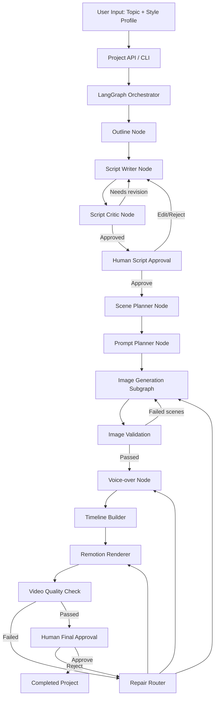
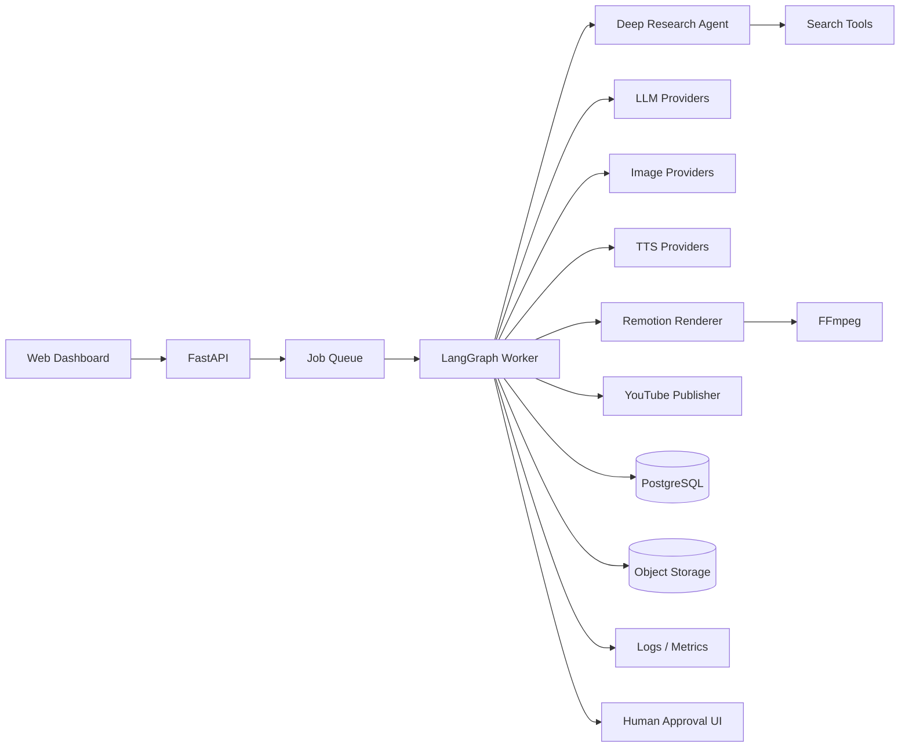

# Proof of Concept Plan
## เธฃเธฐเธšเธšเธชเธฃเน‰เธฒเธ‡เธงเธดเธ”เธตเน‚เธญ YouTube เนเธšเธš Voice-over + เธ เธฒเธžเธเธฒเธฃเนŒเธ•เธนเธ™เธญเธฑเธ•เน‚เธ™เธกเธฑเธ•เธดเธ”เน‰เธงเธข LangGraph

**เธŠเธทเนˆเธญเน‚เธ›เธฃเน€เธˆเธเธ•เนŒเธŠเธฑเนˆเธงเธ„เธฃเธฒเธง:** YouTube Story Automation
**เน€เธงเธญเธฃเนŒเธŠเธฑเธ™เน€เธญเธเธชเธฒเธฃ:** 0.1
**เธงเธฑเธ™เธ—เธตเนˆ:** 24 เธกเธดเธ–เธธเธ™เธฒเธขเธ™ 2026
**เธชเธ–เธฒเธ™เธฐ:** Proof of Concept Planning
**เน€เธ›เน‰เธฒเธซเธกเธฒเธขเธซเธฅเธฑเธ:** เธฃเธฑเธšเธซเธฑเธงเธ‚เน‰เธญเธซเธ™เธถเนˆเธ‡เธซเธฑเธงเธ‚เน‰เธญ เนเธฅเน‰เธงเธชเธฃเน‰เธฒเธ‡เธงเธดเธ”เธตเน‚เธญเน€เธฅเนˆเธฒเน€เธฃเธทเนˆเธญเธ‡เนเธšเธš Voice-over เธ›เธฃเธฐเธเธญเธšเธ เธฒเธžเธ™เธดเนˆเธ‡เธเธฒเธฃเนŒเธ•เธนเธ™ เธˆเธ™เน„เธ”เน‰เน„เธŸเธฅเนŒเธงเธดเธ”เธตเน‚เธญเธ—เธตเนˆเธžเธฃเน‰เธญเธกเนƒเธซเน‰เธกเธ™เธธเธฉเธขเนŒเธ•เธฃเธงเธˆเธชเธญเธšเธเนˆเธญเธ™เน€เธœเธขเนเธžเธฃเนˆ

---

## 1. Executive Summary

เน‚เธ›เธฃเน€เธˆเธเธ•เนŒเธ™เธตเน‰เธกเธตเน€เธ›เน‰เธฒเธซเธกเธฒเธขเธชเธฃเน‰เธฒเธ‡เธฃเธฐเธšเธšเธเธถเนˆเธ‡เธญเธฑเธ•เน‚เธ™เธกเธฑเธ•เธดเธชเธณเธซเธฃเธฑเธšเธœเธฅเธดเธ•เธงเธดเธ”เธตเน‚เธญ YouTube เธ„เธงเธฒเธกเธขเธฒเธงเธ›เธฃเธฐเธกเธฒเธ“ 8โ€“10 เธ™เธฒเธ—เธต เน‚เธ”เธขเธกเธตเธฃเธนเธ›เนเธšเธšเธ„เธฅเน‰เธฒเธขเธŠเนˆเธญเธ‡เน€เธฅเนˆเธฒเน€เธฃเธทเนˆเธญเธ‡เธ”เน‰เธงเธขเธ เธฒเธžเธเธฒเธฃเนŒเธ•เธนเธ™เน€เธฃเธตเธขเธšเธ‡เนˆเธฒเธข เน„เธ”เน‰เนเธเนˆ

- เธกเธต Voice-over เน€เธฅเนˆเธฒเน€เธฃเธทเนˆเธญเธ‡เธ•เนˆเธญเน€เธ™เธทเนˆเธญเธ‡
- เนƒเธŠเน‰เธ เธฒเธžเธ™เธดเนˆเธ‡เธเธฒเธฃเนŒเธ•เธนเธ™เธ›เธฃเธฐเธเธญเธšเธ•เธฒเธกเน€เธ™เธทเน‰เธญเธซเธฒ
- เน€เธ›เธฅเธตเนˆเธขเธ™เธ เธฒเธžเธซเธฃเธทเธญเธกเธธเธกเธกเธญเธ‡เธ—เธธเธเธ›เธฃเธฐเธกเธฒเธ“ 4โ€“7 เธงเธดเธ™เธฒเธ—เธต
- เนƒเธŠเน‰เธเธฒเธฃเธ‹เธนเธก เน€เธฅเธทเนˆเธญเธ™ เนเธฅเธฐเธ‚เธขเธฑเธšเธญเธ‡เธ„เนŒเธ›เธฃเธฐเธเธญเธšเน€เธžเธทเนˆเธญเนƒเธซเน‰เธ เธฒเธžเธ™เธดเนˆเธ‡เน„เธกเนˆเธ”เธนเธ™เธดเนˆเธ‡เน€เธเธดเธ™เน„เธ›
- เนƒเธŠเน‰เธฃเธฐเธšเธšเธชเธฃเน‰เธฒเธ‡เธšเธ— เนเธšเนˆเธ‡เธ‰เธฒเธ เธชเธฃเน‰เธฒเธ‡ Prompt เธชเธฃเน‰เธฒเธ‡เธ เธฒเธž เธชเธฃเน‰เธฒเธ‡เน€เธชเธตเธขเธ‡ เนเธฅเธฐ Render เธงเธดเธ”เธตเน‚เธญ
- เธซเธขเธธเธ”เธฃเธญเนƒเธซเน‰เธกเธ™เธธเธฉเธขเนŒเธ•เธฃเธงเธˆเธชเธญเธšเธเนˆเธญเธ™เธญเธฑเธ›เน‚เธซเธฅเธ” YouTube

เธฃเธฐเธšเธšเธˆเธฐเนƒเธŠเน‰ **LangGraph เน€เธ›เน‡เธ™เนเธเธ™เธเธฅเธฒเธ‡เธ‚เธญเธ‡ Workflow** เน€เธžเธฃเธฒเธฐเน€เธซเธกเธฒเธฐเธเธฑเธšเธ‡เธฒเธ™เธซเธฅเธฒเธขเธ‚เธฑเน‰เธ™เธ•เธญเธ™เธ—เธตเนˆเธ•เน‰เธญเธ‡เธšเธฑเธ™เธ—เธถเธเธชเธ–เธฒเธ™เธฐ เธ—เธณเธ•เนˆเธญเธˆเธฒเธเธˆเธธเธ”เน€เธ”เธดเธก Retry เน€เธ‰เธžเธฒเธฐเธ‡เธฒเธ™เธ—เธตเนˆเธœเธดเธ” เนเธฅเธฐเธกเธตเธˆเธธเธ” Human-in-the-loop

เธšเธ—เธšเธฒเธ—เธ‚เธญเธ‡เนเธ•เนˆเธฅเธฐ Framework:

- **LangGraph:** เธ„เธงเธšเธ„เธธเธกเธฅเธณเธ”เธฑเธšเธ‡เธฒเธ™ เธชเธ–เธฒเธ™เธฐ เธเธฒเธฃเนเธ•เธเนเธ‚เธ™เธ‡ Retry เนเธฅเธฐ Checkpoint
- **LangChain:** เน€เธŠเธทเนˆเธญเธก LLM, Structured Output เนเธฅเธฐ Tool เธ•เนˆเธฒเธ‡ เน†
- **Deep Agents:** เนƒเธŠเน‰เนƒเธ™เธฃเธฐเธขเธฐเธซเธฅเธฑเธ‡เธชเธณเธซเธฃเธฑเธšเธ‡เธฒเธ™ Research เธ—เธตเนˆเน€เธ›เธดเธ”เธเธงเน‰เธฒเธ‡เนเธฅเธฐเธ‹เธฑเธšเธ‹เน‰เธญเธ™ เน„เธกเนˆเนƒเธŠเน‰เน€เธ›เน‡เธ™เนเธเธ™เธซเธฅเธฑเธเธ‚เธญเธ‡ POC
- **Cloudflare Workers AI:** เธชเธฃเน‰เธฒเธ‡เธ เธฒเธžเธœเนˆเธฒเธ™ API เน‚เธ”เธขเน„เธกเนˆเนƒเธŠเน‰ GPU เน€เธ„เธฃเธทเนˆเธญเธ‡
- **Remotion:** เธ›เธฃเธฐเธเธญเธš Scene เนเธฅเธฐ Motion เธ”เน‰เธงเธข React/TypeScript
- **FFmpeg:** เธ•เธฃเธงเธˆเน„เธŸเธฅเนŒเน€เธชเธตเธขเธ‡ เธฃเธงเธกเน€เธชเธตเธขเธ‡ เธ›เธฃเธฑเธšเธฃเธฐเธ”เธฑเธšเน€เธชเธตเธขเธ‡ เนเธฅเธฐเนเธ›เธฅเธ‡เน„เธŸเธฅเนŒ
- **YouTube Data API:** เธญเธฑเธ›เน‚เธซเธฅเธ”เธซเธฅเธฑเธ‡เธœเนˆเธฒเธ™เธเธฒเธฃเธญเธ™เธธเธกเธฑเธ•เธดเนƒเธ™เธฃเธฐเธขเธฐเธ–เธฑเธ”เน„เธ›

เนเธ™เธงเธ—เธฒเธ‡เธชเธณเธ„เธฑเธเธ„เธทเธญ **เน„เธกเนˆเธชเธฃเน‰เธฒเธ‡ Super Agent เธ•เธฑเธงเน€เธ”เธตเธขเธงเนƒเธซเน‰เธ•เธฑเธ”เธชเธดเธ™เนƒเธˆเธ—เธฑเน‰เธ‡เธซเธกเธ”** เนเธ•เนˆเนƒเธŠเน‰ Workflow เธ—เธตเนˆเธ„เธงเธšเธ„เธธเธกเน„เธ”เน‰ เน‚เธ”เธขเนƒเธซเน‰ LLM เธ•เธฑเธ”เธชเธดเธ™เนƒเธˆเน€เธ‰เธžเธฒเธฐเธ‡เธฒเธ™เธ—เธตเนˆเธ•เน‰เธญเธ‡เนƒเธŠเน‰เธ เธฒเธฉเธฒ เธ„เธงเธฒเธกเธ„เธดเธ”เธชเธฃเน‰เธฒเธ‡เธชเธฃเธฃเธ„เนŒ เธซเธฃเธทเธญเธเธฒเธฃเธ•เธตเธ„เธงเธฒเธก เนเธฅเธฐเนƒเธŠเน‰เน‚เธ„เน‰เธ”เธ›เธเธ•เธดเธ—เธณเธ‡เธฒเธ™เธ—เธตเนˆเธ•เน‰เธญเธ‡เนเธ™เนˆเธ™เธญเธ™ เน€เธŠเนˆเธ™ เธ•เธฑเน‰เธ‡เธŠเธทเนˆเธญเน„เธŸเธฅเนŒ เธ•เธฃเธงเธˆเน„เธŸเธฅเนŒ Retry API เธ„เธณเธ™เธงเธ“เน€เธงเธฅเธฒ เนเธฅเธฐ Render

---

## 2. Problem Statement

เธเธฒเธฃเธ—เธณเธงเธดเธ”เธตเน‚เธญ Voice-over เธ›เธฃเธฐเธเธญเธšเธ เธฒเธžเธ™เธดเนˆเธ‡เนเธšเธš Manual เธกเธตเธ‚เธฑเน‰เธ™เธ•เธญเธ™เธ‹เน‰เธณเธˆเธณเธ™เธงเธ™เธกเธฒเธ เน€เธŠเนˆเธ™

1. เน€เธฅเธทเธญเธเธซเธฑเธงเธ‚เน‰เธญ
2. เธ„เน‰เธ™เธ„เธงเน‰เธฒเธ‚เน‰เธญเธกเธนเธฅ
3. เน€เธ‚เธตเธขเธ™ Outline
4. เน€เธ‚เธตเธขเธ™เธšเธ—
5. เนเธšเนˆเธ‡เธšเธ—เธญเธญเธเน€เธ›เน‡เธ™เธ‰เธฒเธ
6. เน€เธ‚เธตเธขเธ™ Prompt เธชเธณเธซเธฃเธฑเธšเนเธ•เนˆเธฅเธฐเธ เธฒเธž
7. เธชเธฃเน‰เธฒเธ‡เธ เธฒเธžเธˆเธณเธ™เธงเธ™เธกเธฒเธ
8. เธ•เธฃเธงเธˆเธ เธฒเธžเน€เธชเธตเธขเธซเธฃเธทเธญเธ เธฒเธžเน„เธกเนˆเธ•เธฃเธ‡เน€เธ™เธทเน‰เธญเธซเธฒ
9. เธชเธฃเน‰เธฒเธ‡ Voice-over
10. เธˆเธฑเธ” Timeline เนƒเธซเน‰เธ เธฒเธžเธ•เธฃเธ‡เน€เธชเธตเธขเธ‡
11. เนƒเธชเนˆ Motion
12. Render
13. เธ•เธฃเธงเธˆเธ„เธธเธ“เธ เธฒเธž
14. เธชเธฃเน‰เธฒเธ‡ Metadata
15. เธญเธฑเธ›เน‚เธซเธฅเธ”

เธ›เธฑเธเธซเธฒเธซเธฅเธฑเธเธ‚เธญเธ‡เธเธฒเธฃเนƒเธŠเน‰ Agent เธ•เธฑเธงเน€เธ”เธตเธขเธงเธˆเธฑเธ”เธเธฒเธฃเธ—เธฑเน‰เธ‡เธซเธกเธ”เธ„เธทเธญ

- เธœเธฅเธฅเธฑเธžเธ˜เนŒเน„เธกเนˆเนเธ™เนˆเธ™เธญเธ™
- Debug เธขเธฒเธ
- เธญเธฒเธˆเน€เธฃเธตเธขเธ API เธ‹เน‰เธณเน‚เธ”เธขเน„เธกเนˆเธˆเธณเน€เธ›เน‡เธ™
- เธ–เน‰เธฒเธžเธฑเธ‡เธ•เธญเธ™เธ—เน‰เธฒเธขเธญเธฒเธˆเธ•เน‰เธญเธ‡เน€เธฃเธดเนˆเธกเนƒเธซเธกเนˆ
- เน„เธกเนˆเธฃเธนเน‰เธงเนˆเธฒเธชเนˆเธงเธ™เนƒเธ”เน€เธ›เน‡เธ™เธ•เน‰เธ™เน€เธซเธ•เธธเธ‚เธญเธ‡เธ‚เน‰เธญเธœเธดเธ”เธžเธฅเธฒเธ”
- เธ„เธงเธšเธ„เธธเธกเธ‡เธšเนเธฅเธฐเน‚เธ„เธงเธ•เธฒเธขเธฒเธ
- เธกเธตเธ„เธงเธฒเธกเน€เธชเธตเนˆเธขเธ‡เธชเธฃเน‰เธฒเธ‡เธ‚เน‰เธญเธกเธนเธฅเธœเธดเธ”เธซเธฃเธทเธญเน€เธœเธขเนเธžเธฃเนˆเน‚เธ”เธขเน„เธกเนˆเธ•เธฃเธงเธˆเธชเธญเธš

เธ”เธฑเธ‡เธ™เธฑเน‰เธ™เธฃเธฐเธšเธšเธ™เธตเน‰เธˆเธฐเธญเธญเธเนเธšเธšเน€เธ›เน‡เธ™ **Controlled Agentic Workflow**

---

## 3. เน€เธ›เน‰เธฒเธซเธกเธฒเธขเธ‚เธญเธ‡ POC

### 3.1 เน€เธ›เน‰เธฒเธซเธกเธฒเธขเธซเธฅเธฑเธ

POC เธ•เน‰เธญเธ‡เธžเธดเธชเธนเธˆเธ™เนŒเธงเนˆเธฒ เน€เธกเธทเนˆเธญเธœเธนเน‰เนƒเธŠเน‰เธเธฃเธญเธเธซเธฑเธงเธ‚เน‰เธญ เธฃเธฐเธšเธšเธชเธฒเธกเธฒเธฃเธ–เธ—เธณเธ‡เธฒเธ™เธ•เธฒเธกเธฅเธณเธ”เธฑเธšเธ•เนˆเธญเน„เธ›เธ™เธตเน‰เน„เธ”เน‰

```text
Topic
โ†’ Outline
โ†’ Script
โ†’ Script Review
โ†’ Scene Plan
โ†’ Image Prompt
โ†’ Image Generation
โ†’ Voice-over
โ†’ Timeline
โ†’ Video Render
โ†’ Quality Report
โ†’ Human Approval
```

### 3.2 เธชเธดเนˆเธ‡เธ—เธตเนˆ POC เธ•เน‰เธญเธ‡เนเธชเธ”เธ‡เนƒเธซเน‰เน€เธซเน‡เธ™

- LangGraph เธ„เธงเธšเธ„เธธเธก Workflow เน„เธ”เน‰เธ„เธฃเธšเธงเธ‡เธˆเธฃ
- เน€เธเน‡เธšเธชเธ–เธฒเธ™เธฐเนเธฅเธฐเธ—เธณเธ•เนˆเธญเธˆเธฒเธเธˆเธธเธ”เน€เธ”เธดเธกเน„เธ”เน‰
- LLM เธ„เธทเธ™ Structured Output เธ—เธตเนˆเธœเนˆเธฒเธ™ Schema
- เธชเธฃเน‰เธฒเธ‡เธ เธฒเธžเธœเนˆเธฒเธ™ Cloudflare API เน„เธ”เน‰
- Retry เน€เธ‰เธžเธฒเธฐเธ เธฒเธžเธ—เธตเนˆเธฅเน‰เธกเน€เธซเธฅเธงเน„เธ”เน‰
- เธชเธฃเน‰เธฒเธ‡เน€เธชเธตเธขเธ‡เธซเธฃเธทเธญเธฃเธฑเธšเน„เธŸเธฅเนŒเน€เธชเธตเธขเธ‡เน€เธ‚เน‰เธฒ Pipeline เน„เธ”เน‰
- Remotion เธญเนˆเธฒเธ™ Scene JSON เนเธฅเน‰เธง Render เธงเธดเธ”เธตเน‚เธญเน„เธ”เน‰
- เธกเธตเธซเธ™เน‰เธฒเธซเธฃเธทเธญ CLI เนƒเธซเน‰เธœเธนเน‰เนƒเธŠเน‰ Approve, Reject เธซเธฃเธทเธญเนเธเน‰เน„เธ‚
- เธ—เธธเธ Asset เธ–เธนเธเธˆเธฑเธ”เน€เธเน‡เธšเน€เธ›เน‡เธ™ Project Folder เธ—เธตเนˆเธ•เธฃเธงเธˆเธชเธญเธšเธขเน‰เธญเธ™เธซเธฅเธฑเธ‡เน„เธ”เน‰

### 3.3 เน€เธ›เน‰เธฒเธซเธกเธฒเธขเน€เธŠเธดเธ‡เธ›เธฃเธดเธกเธฒเธ“เธ‚เธญเธ‡ POC

POC เธฃเธธเนˆเธ™เนเธฃเธเน„เธกเนˆเธˆเธณเน€เธ›เน‡เธ™เธ•เน‰เธญเธ‡เธชเธฃเน‰เธฒเธ‡เธ„เธฅเธดเธ› 8โ€“10 เธ™เธฒเธ—เธตเธ—เธฑเธ™เธ—เธต

| เธฃเธฒเธขเธเธฒเธฃ | เน€เธ›เน‰เธฒเธซเธกเธฒเธข POC |
|---|---:|
| เธ„เธงเธฒเธกเธขเธฒเธงเธงเธดเธ”เธตเน‚เธญ | 2โ€“4 เธ™เธฒเธ—เธต |
| เธˆเธณเธ™เธงเธ™เธ„เธณ Voice-over | 300โ€“600 เธ„เธณ |
| เธˆเธณเธ™เธงเธ™ Visual Shots | 25โ€“50 Shots |
| เธˆเธณเธ™เธงเธ™เธ เธฒเธž AI เธ—เธตเนˆเน„เธกเนˆเธ‹เน‰เธณ | 15โ€“35 เธ เธฒเธž |
| เธ„เธงเธฒเธกเธฅเธฐเน€เธญเธตเธขเธ” Output | 1920ร—1080 |
| Frame rate | 30 FPS |
| เธฃเธนเธ›เนเธšเธšเน„เธŸเธฅเนŒ | MP4 H.264 + AAC |
| เธˆเธธเธ”เธญเธ™เธธเธกเธฑเธ•เธดเธˆเธฒเธเธกเธ™เธธเธฉเธขเนŒ | เธญเธขเนˆเธฒเธ‡เธ™เน‰เธญเธข 2 เธˆเธธเธ” |
| เธ„เธงเธฒเธกเธชเธฒเธกเธฒเธฃเธ– Resume | เธ•เน‰เธญเธ‡เธกเธต |
| Retry เน€เธ‰เธžเธฒเธฐ Scene | เธ•เน‰เธญเธ‡เธกเธต |

เธซเธฅเธฑเธ‡เธˆเธฒเธ POC เธœเนˆเธฒเธ™ เธˆเธถเธ‡เธ‚เธขเธฒเธขเน€เธ›เน‡เธ™

- เธงเธดเธ”เธตเน‚เธญ 8โ€“10 เธ™เธฒเธ—เธต
- 80โ€“150 Visual Shots
- 40โ€“100 Unique Images
- Thumbnail เนเธฅเธฐ Metadata เธญเธฑเธ•เน‚เธ™เธกเธฑเธ•เธด
- Research Agent
- YouTube Upload

---

## 4. เธ‚เธญเธšเน€เธ‚เธ•เธ‚เธญเธ‡ POC

### 4.1 In Scope

- CLI เธซเธฃเธทเธญ Minimal Web UI เธชเธณเธซเธฃเธฑเธšเธชเธฃเน‰เธฒเธ‡เน‚เธ›เธฃเน€เธˆเธเธ•เนŒ
- เธฃเธฑเธš Topic เนเธฅเธฐ Channel Style Profile
- เธชเธฃเน‰เธฒเธ‡ Outline
- เธชเธฃเน‰เธฒเธ‡ Script
- เธ•เธฃเธงเธˆ Script เธ”เน‰เธงเธข Critic Node
- เนเธšเนˆเธ‡ Script เน€เธ›เน‡เธ™ Scene
- เธชเธฃเน‰เธฒเธ‡ Prompt เธ เธฒเธžเนเธ•เนˆเธฅเธฐ Scene
- เธชเธฃเน‰เธฒเธ‡เธ เธฒเธžเธœเนˆเธฒเธ™ Cloudflare Workers AI
- เน€เธเน‡เธš Cache เธ›เน‰เธญเธ‡เธเธฑเธ™เธเธฒเธฃเธชเธฃเน‰เธฒเธ‡เธ เธฒเธžเธ‹เน‰เธณ
- เธชเธฃเน‰เธฒเธ‡เธซเธฃเธทเธญเธฃเธฑเธš Voice-over
- เธญเนˆเธฒเธ™เธ„เธงเธฒเธกเธขเธฒเธงเน€เธชเธตเธขเธ‡
- เธ„เธณเธ™เธงเธ“ Timeline
- Render เธ”เน‰เธงเธข Remotion
- เธ•เธฃเธงเธˆ Output เธ‚เธฑเน‰เธ™เธžเธทเน‰เธ™เธเธฒเธ™
- Human Approval เธเนˆเธญเธ™เธ–เธทเธญเธงเนˆเธฒเธ‡เธฒเธ™เน€เธชเธฃเน‡เธˆ
- SQLite Checkpoint
- Local File Storage
- Logging เนเธฅเธฐ Error Report

### 4.2 Out of Scope เธชเธณเธซเธฃเธฑเธš POC เธฃเธธเนˆเธ™เนเธฃเธ

- เธญเธฑเธ›เน‚เธซเธฅเธ” YouTube เนเธšเธšเธญเธฑเธ•เน‚เธ™เธกเธฑเธ•เธดเธ—เธฑเธ™เธ—เธต
- เธ„เน‰เธ™เธซเธฒ Viral Topic เนเธšเธšเธญเธฑเธ•เน‚เธ™เธกเธฑเธ•เธดเน€เธ•เน‡เธกเธฃเธนเธ›เนเธšเธš
- เธงเธดเน€เธ„เธฃเธฒเธฐเธซเนŒ Retention เธˆเธฒเธ YouTube Analytics
- เธชเธฃเน‰เธฒเธ‡เน€เธžเธฅเธ‡เธ›เธฃเธฐเธเธญเธšเธ”เน‰เธงเธข AI
- เธชเธฃเน‰เธฒเธ‡เธงเธดเธ”เธตเน‚เธญ AI เน€เธ„เธฅเธทเนˆเธญเธ™เน„เธซเธงเธ—เธธเธเธ‰เธฒเธ
- Clone เน€เธชเธตเธขเธ‡เธšเธธเธ„เธ„เธฅ
- Multi-language
- เธฃเธฐเธšเธš SaaS เธซเธฅเธฒเธขเธœเธนเน‰เนƒเธŠเน‰
- Cloud Deployment เน€เธ•เน‡เธกเธฃเธนเธ›เนเธšเธš
- Image Character Consistency เธ‚เธฑเน‰เธ™เธชเธนเธ‡
- เธชเธฃเน‰เธฒเธ‡เธ เธฒเธž 4K เนเธ—เน‰เธ—เธธเธเธ เธฒเธž
- Full autonomous publishing เน‚เธ”เธขเน„เธกเนˆเธกเธตเธกเธ™เธธเธฉเธขเนŒเธ•เธฃเธงเธˆ

---

## 5. Assumptions

1. เนƒเธŠเน‰ Python เน€เธ›เน‡เธ™ Backend เนเธฅเธฐ Orchestrator
2. เนƒเธŠเน‰ TypeScript/React เธชเธณเธซเธฃเธฑเธš Remotion
3. เนƒเธŠเน‰ Windows เน€เธ›เน‡เธ™เน€เธ„เธฃเธทเนˆเธญเธ‡เธžเธฑเธ’เธ™เธฒเธซเธฅเธฑเธเน„เธ”เน‰
4. เธกเธต Node.js เนเธฅเธฐ FFmpeg เธ•เธดเธ”เธ•เธฑเน‰เธ‡เนƒเธ™เน€เธ„เธฃเธทเนˆเธญเธ‡
5. เนƒเธŠเน‰ Cloudflare Workers AI เน€เธ›เน‡เธ™ Image Provider เน€เธฃเธดเนˆเธกเธ•เน‰เธ™
6. LLM เธ•เน‰เธญเธ‡เน€เธ›เธฅเธตเนˆเธขเธ™ Provider เน„เธ”เน‰เธœเนˆเธฒเธ™ Adapter
7. เน€เธฃเธดเนˆเธกเธ•เน‰เธ™เธ”เน‰เธงเธข Gemini API เธซเธฃเธทเธญเน‚เธกเน€เธ”เธฅเธ—เธตเนˆเธฃเธญเธ‡เธฃเธฑเธš Structured Output เนเธฅเธฐ Tool Calling
8. เน€เธชเธตเธขเธ‡เน„เธ—เธขเธ•เน‰เธญเธ‡เน€เธ›เธฅเธตเนˆเธขเธ™ Provider เน„เธ”เน‰ เน„เธกเนˆเธœเธนเธเธเธฑเธšเธšเธฃเธดเธเธฒเธฃเน€เธ”เธตเธขเธง
9. เธœเธนเน‰เนƒเธŠเน‰เธ•เธฃเธงเธˆ Script เนเธฅเธฐ Preview เธเนˆเธญเธ™เน€เธœเธขเนเธžเธฃเนˆ
10. เธฃเธฐเธšเธšเธ•เน‰เธญเธ‡เธ—เธณเธ‡เธฒเธ™เธ‹เน‰เธณเน„เธ”เน‰เน‚เธ”เธขเน„เธกเนˆเธชเธฃเน‰เธฒเธ‡ Asset เน€เธ”เธดเธกเธ‹เน‰เธณเน‚เธ”เธขเน„เธกเนˆเธˆเธณเน€เธ›เน‡เธ™
11. เธชเน„เธ•เธฅเนŒเธ เธฒเธžเธ•เน‰เธญเธ‡เน€เธ›เน‡เธ™เน€เธญเธเธฅเธฑเธเธฉเธ“เนŒเธ‚เธญเธ‡เธŠเนˆเธญเธ‡เน€เธญเธ‡ เน„เธกเนˆเธ„เธฑเธ”เธฅเธญเธ Character เธซเธฃเธทเธญ Branding เธ‚เธญเธ‡เธŠเนˆเธญเธ‡เธ•เธฑเธงเธญเธขเนˆเธฒเธ‡เน‚เธ”เธขเธ•เธฃเธ‡

---

## 6. Architecture Decision

### 6.1 เธ—เธณเน„เธกเนƒเธŠเน‰ LangGraph เน€เธ›เน‡เธ™เธ•เธฑเธงเธซเธฅเธฑเธ

Workflow เธ™เธตเน‰เธกเธตเธ„เธธเธ“เธชเธกเธšเธฑเธ•เธดเธ—เธตเนˆเน€เธซเธกเธฒเธฐเธเธฑเธš Graph:

- เธกเธตเธซเธฅเธฒเธขเธ‚เธฑเน‰เธ™เธ•เธญเธ™เธ—เธตเนˆเธ•เน‰เธญเธ‡เน€เธฃเธตเธขเธ‡เธฅเธณเธ”เธฑเธš
- เธšเธฒเธ‡เธ‚เธฑเน‰เธ™เธ•เธญเธ™เธชเธฒเธกเธฒเธฃเธ–เธ—เธณ Parallel
- เธšเธฒเธ‡เธ‚เธฑเน‰เธ™เธ•เธญเธ™เธ•เน‰เธญเธ‡ Loop เธเธฅเธฑเธšเน„เธ›เนเธเน‰
- เธกเธต External API เธ—เธตเนˆเธญเธฒเธˆเธฅเน‰เธกเน€เธซเธฅเธง
- เธ•เน‰เธญเธ‡เธซเธขเธธเธ”เธฃเธญ Human Approval
- เธ•เน‰เธญเธ‡ Resume เธซเธฅเธฑเธ‡เธ›เธดเธ”เน‚เธ›เธฃเนเธเธฃเธกเธซเธฃเธทเธญ Error
- เธ•เน‰เธญเธ‡ Retry เน€เธ‰เธžเธฒเธฐ Scene
- เธ•เน‰เธญเธ‡เน€เธเน‡เธš State เธ—เธตเนˆเธ•เธฃเธงเธˆเธชเธญเธšเธขเน‰เธญเธ™เธซเธฅเธฑเธ‡เน„เธ”เน‰

### 6.2 เธšเธ—เธšเธฒเธ— LangChain

LangChain เนƒเธŠเน‰เธชเธณเธซเธฃเธฑเธš

- Model abstraction
- Prompt template
- Structured output
- Tool definition
- Middleware
- Message handling
- เน€เธŠเธทเนˆเธญเธก Provider เธซเธฅเธฒเธขเน€เธˆเน‰เธฒ

### 6.3 เธšเธ—เธšเธฒเธ— Deep Agents

Deep Agents **เน„เธกเนˆเนƒเธŠเนˆ Main Orchestrator** เธ‚เธญเธ‡ POC

เนƒเธŠเน‰เธ เธฒเธขเธซเธฅเธฑเธ‡เธชเธณเธซเธฃเธฑเธšเธ‡เธฒเธ™ เน€เธŠเนˆเธ™

- Research เธซเธฅเธฒเธขเนเธซเธฅเนˆเธ‡
- เธงเธฒเธ‡เนเธœเธ™เธ„เน‰เธ™เธ„เธงเน‰เธฒ
- เธญเนˆเธฒเธ™เน€เธญเธเธชเธฒเธฃเธˆเธณเธ™เธงเธ™เธกเธฒเธ
- เนเธšเนˆเธ‡เธ‡เธฒเธ™เนƒเธซเน‰ Subagent
- เธชเธฃเธธเธ› Research Dossier
- เธ•เธฃเธงเธˆเธ„เธงเธฒเธกเธ‚เธฑเธ”เนเธขเน‰เธ‡เธ‚เธญเธ‡เธ‚เน‰เธญเธกเธนเธฅ

เน€เธซเธ•เธธเธœเธฅเธ—เธตเนˆเน„เธกเนˆเนƒเธŠเน‰เธ•เธฑเน‰เธ‡เนเธ•เนˆเนเธฃเธ:

- เน€เธžเธดเนˆเธกเธ„เธงเธฒเธกเธ‹เธฑเธšเธ‹เน‰เธญเธ™
- Debug เธขเธฒเธเธ‚เธถเน‰เธ™
- เนƒเธŠเน‰ Token เธกเธฒเธเธ‚เธถเน‰เธ™
- เธญเธฒเธˆเน€เธฃเธตเธขเธ Tool เน€เธเธดเธ™เธˆเธณเน€เธ›เน‡เธ™
- POC เธ•เน‰เธญเธ‡เธžเธดเธชเธนเธˆเธ™เนŒ Media Pipeline เธเนˆเธญเธ™ Research Agent

---

## 7. High-Level Architecture



---

## 8. Workflow เธซเธฅเธฑเธ

### 8.1 Node List

1. `initialize_project`
2. `validate_input`
3. `generate_outline`
4. `review_outline`
5. `write_script`
6. `critique_script`
7. `human_script_approval`
8. `plan_scenes`
9. `generate_image_prompts`
10. `estimate_budget`
11. `generate_images`
12. `validate_images`
13. `generate_voice`
14. `analyze_audio`
15. `build_timeline`
16. `prepare_render_payload`
17. `render_video`
18. `validate_video`
19. `human_final_approval`
20. `complete_project`

### 8.2 Conditional Edges

```text
critique_script
โ”œโ”€โ”€ score >= threshold โ†’ human_script_approval
โ”œโ”€โ”€ factual_gap โ†’ research/manual_sources
โ”œโ”€โ”€ weak_hook โ†’ write_script
โ”œโ”€โ”€ repetitive โ†’ write_script
โ””โ”€โ”€ invalid_schema โ†’ retry_structured_output
```

```text
validate_images
โ”œโ”€โ”€ all_passed โ†’ generate_voice
โ”œโ”€โ”€ failed_count <= retry_limit โ†’ regenerate_failed_images
โ”œโ”€โ”€ quota_exceeded โ†’ pause_until_reset_or_manual_action
โ””โ”€โ”€ provider_error โ†’ fallback_provider_or_pause
```

```text
validate_video
โ”œโ”€โ”€ passed โ†’ human_final_approval
โ”œโ”€โ”€ missing_asset โ†’ regenerate_or_relink
โ”œโ”€โ”€ audio_timing_error โ†’ rebuild_timeline
โ”œโ”€โ”€ render_error โ†’ rerender
โ””โ”€โ”€ invalid_resolution โ†’ transcode
```

---

## 9. State Model

State เธ•เน‰เธญเธ‡เน€เธเน‡เธšเน€เธ‰เธžเธฒเธฐเธ‚เน‰เธญเธกเธนเธฅเธ—เธตเนˆเธˆเธณเน€เธ›เน‡เธ™เธ•เนˆเธญ Workflow เธชเนˆเธงเธ™เน„เธŸเธฅเนŒเธ‚เธ™เธฒเธ”เนƒเธซเธเนˆเน€เธเน‡เธšเนƒเธ™ Storage เนเธฅเธฐ State เน€เธเน‡เธš Path

```python
from typing import Literal, TypedDict

class VideoProjectState(TypedDict, total=False):
    project_id: str
    status: str
    created_at: str
    updated_at: str

    topic: str
    target_duration_seconds: int
    target_language: str
    channel_style_profile: dict

    outline: dict
    outline_review: dict

    script: str
    script_version: int
    script_review: dict
    script_approved: bool

    scenes: list[dict]
    scene_count: int

    image_budget: dict
    image_jobs: list[dict]
    generated_images: list[dict]
    failed_scene_ids: list[str]

    voice_provider: str
    voice_path: str | None
    audio_duration_seconds: float | None
    audio_analysis: dict

    timeline: list[dict]
    render_payload_path: str | None
    video_path: str | None

    quality_report: dict
    final_approved: bool

    current_node: str
    retry_counts: dict[str, int]
    errors: list[dict]
    warnings: list[dict]
```

---

## 10. Data Contracts

เธ—เธธเธ LLM Node เธ•เน‰เธญเธ‡เธ„เธทเธ™ Structured Output เธœเนˆเธฒเธ™ Pydantic เธซเน‰เธฒเธก Parse JSON เธˆเธฒเธ Free-form Text เนเธšเธšเน€เธ”เธฒเธชเธธเนˆเธก

### 10.1 Outline Schema

```python
from pydantic import BaseModel, Field

class OutlineSection(BaseModel):
    section_id: str
    title: str
    purpose: str
    key_points: list[str]
    estimated_seconds: int = Field(ge=10, le=180)

class VideoOutline(BaseModel):
    working_title: str
    hook: str
    viewer_promise: str
    sections: list[OutlineSection]
    ending: str
    estimated_total_seconds: int
```

### 10.2 Scene Schema

```python
from typing import Literal
from pydantic import BaseModel, Field

class SceneSpec(BaseModel):
    scene_id: str
    order: int
    narration_text: str
    estimated_duration_seconds: float = Field(ge=2, le=15)

    visual_type: Literal[
        "ai_image",
        "reuse_image",
        "template",
        "title_card",
        "transition"
    ]

    visual_description: str
    image_prompt: str | None = None
    negative_prompt: str | None = None
    reuse_from_scene_id: str | None = None

    motion: Literal[
        "static",
        "zoom_in",
        "zoom_out",
        "pan_left",
        "pan_right",
        "slow_push",
        "parallax"
    ]

    focal_point_x: float = Field(default=0.5, ge=0, le=1)
    focal_point_y: float = Field(default=0.5, ge=0, le=1)

    importance: Literal["low", "normal", "high", "hero"]
```

### 10.3 Image Job Schema

```python
class ImageJob(BaseModel):
    job_id: str
    scene_id: str
    provider: str
    model: str
    prompt_hash: str
    prompt: str
    seed: int | None
    status: Literal[
        "pending",
        "running",
        "completed",
        "failed",
        "skipped",
        "cached"
    ]
    attempts: int = 0
    output_path: str | None = None
    error_message: str | None = None
```

### 10.4 Quality Report Schema

```python
class QualityIssue(BaseModel):
    severity: Literal["info", "warning", "error", "blocking"]
    component: str
    message: str
    scene_id: str | None = None
    recommended_action: str | None = None

class QualityReport(BaseModel):
    passed: bool
    score: float = Field(ge=0, le=100)
    issues: list[QualityIssue]
```

---

## 11. Channel Style Profile

เธชเน„เธ•เธฅเนŒเธ‚เธญเธ‡เธŠเนˆเธญเธ‡เน„เธกเนˆเธ„เธงเธฃเน€เธ‚เธตเธขเธ™เธ‹เน‰เธณเนƒเธ™เธ—เธธเธ Prompt เนเธšเธšเธเธฃเธฐเธˆเธฑเธ”เธเธฃเธฐเธˆเธฒเธข เนƒเธซเน‰เธชเธฃเน‰เธฒเธ‡ Profile เธเธฅเธฒเธ‡

```yaml
channel_id: simple_story_th
visual_style:
  medium: simple_2d_cartoon
  line_style: thick_black_outline
  color_style: flat_muted_colors
  character_design: round_head_minimal_face
  background_detail: low_to_medium
  realism: low
  texture: subtle_paper
  aspect_strategy: center_safe
  forbidden:
    - photorealistic
    - complex_text
    - watermark
    - copied_brand_character

story_style:
  language: th
  tone: curious_and_explanatory
  pacing: medium_fast
  hook_seconds: 15
  max_scene_seconds: 7

render_style:
  resolution: 1920x1080
  fps: 30
  default_transition_frames: 8
  max_zoom_scale: 1.12
```

เธ›เธฃเธฐเน‚เธขเธŠเธ™เนŒ:

- เน€เธ›เธฅเธตเนˆเธขเธ™ Identity เธŠเนˆเธญเธ‡เน„เธ”เน‰เธˆเธฒเธเน„เธŸเธฅเนŒเน€เธ”เธตเธขเธง
- Prompt เธ—เธธเธ Scene เธกเธต Style เน€เธ”เธตเธขเธงเธเธฑเธ™
- เธ—เธ”เธชเธญเธš Style A/B เน„เธ”เน‰
- เธฅเธ”เธเธฒเธฃ Hard-code

---

## 12. Image Generation Strategy

### 12.1 Provider เนเธฃเธ

เนƒเธŠเน‰ Cloudflare Workers AI เธœเนˆเธฒเธ™ Adapter:

```python
class ImageProvider:
    async def generate(
        self,
        prompt: str,
        seed: int | None,
        options: dict,
    ) -> GeneratedImage:
        ...
```

Implementation เน€เธฃเธดเนˆเธกเธ•เน‰เธ™:

```text
CloudflareFluxSchnellProvider
```

Provider เนƒเธ™เธญเธ™เธฒเธ„เธ•:

```text
LocalStableDiffusionProvider
HuggingFaceProvider
PaidImageProvider
ManualUploadProvider
```

### 12.2 เน„เธกเนˆเธชเธฃเน‰เธฒเธ‡เธ เธฒเธžเนƒเธซเธกเนˆเธ—เธธเธ Visual Shot

เนเธขเธเธ„เธณเธงเนˆเธฒ

- **Visual Shot:** เธŠเนˆเธงเธ‡เธ เธฒเธžเธšเธ™ Timeline
- **Unique Image:** เน„เธŸเธฅเนŒเธ เธฒเธžเธ—เธตเนˆเธชเธฃเน‰เธฒเธ‡เนƒเธซเธกเนˆเธˆเธฃเธดเธ‡

เธ•เธฑเธงเธญเธขเนˆเธฒเธ‡:

```text
60 Visual Shots
โ”œโ”€โ”€ 28 Unique AI Images
โ”œโ”€โ”€ 12 Reused Images with different crop
โ”œโ”€โ”€ 10 Template Scenes
โ”œโ”€โ”€ 5 Title/Diagram Scenes
โ””โ”€โ”€ 5 Transition Scenes
```

### 12.3 Image Budget Node

เธเนˆเธญเธ™ Generate เธฃเธฐเธšเธšเธ•เน‰เธญเธ‡เธ„เธณเธ™เธงเธ“เธ‡เธš

```python
image_budget = {
    "max_unique_images": 35,
    "max_attempts_per_image": 3,
    "max_total_requests": 60,
    "reserved_requests_for_thumbnail": 4,
    "reuse_target_ratio": 0.30,
}
```

เธ–เน‰เธฒ Scene Planner เธชเธฃเน‰เธฒเธ‡เธ เธฒเธžเน€เธเธดเธ™เธ‡เธš เนƒเธซเน‰ Budget Optimizer:

1. เธฃเธงเธก Scene เธ—เธตเนˆ Visual เนƒเธเธฅเน‰เธเธฑเธ™
2. เน€เธ›เธฅเธตเนˆเธขเธ™เธšเธฒเธ‡ Scene เน€เธ›เน‡เธ™ `reuse_image`
3. เน€เธ›เธฅเธตเนˆเธขเธ™เธšเธฒเธ‡ Scene เน€เธ›เน‡เธ™ `template`
4. เธฅเธ” Scene เธ„เธงเธฒเธกเธชเธณเธ„เธฑเธเธ•เนˆเธณ
5. เธฃเธฑเธเธฉเธฒ Hero Scene เน„เธงเน‰

### 12.4 Caching

เธชเธฃเน‰เธฒเธ‡ Hash เธˆเธฒเธ

```text
model + normalized_prompt + seed + options
```

เธเนˆเธญเธ™เน€เธฃเธตเธขเธ API:

```text
Cache Hit  โ†’ เนƒเธŠเน‰เน„เธŸเธฅเนŒเน€เธ”เธดเธก
Cache Miss โ†’ เน€เธฃเธตเธขเธ Provider
```

เธซเน‰เธฒเธกเน€เธฃเธตเธขเธ API เธ‹เน‰เธณเน€เธžเธตเธขเธ‡เน€เธžเธฃเธฒเธฐ Graph Replay เน€เธงเน‰เธ™เนเธ•เนˆเธœเธนเน‰เนƒเธŠเน‰เธชเธฑเนˆเธ‡ Force Regenerate

### 12.5 Image Validation เธฃเธธเนˆเธ™ POC

เธ•เธฃเธงเธˆเนเธšเธš Deterministic เธเนˆเธญเธ™:

- เน„เธŸเธฅเนŒเธกเธตเธˆเธฃเธดเธ‡
- เน€เธ›เธดเธ”เธญเนˆเธฒเธ™เน„เธ”เน‰
- MIME เธ–เธนเธเธ•เน‰เธญเธ‡
- เธ„เธงเธฒเธกเธเธงเน‰เธฒเธ‡เนเธฅเธฐเธ„เธงเธฒเธกเธชเธนเธ‡เธกเธฒเธเธเธงเนˆเธฒ Minimum
- File size เน„เธกเนˆเน€เธ›เน‡เธ™เธจเธนเธ™เธขเนŒ
- เน„เธกเนˆเธกเธตเธ เธฒเธžเธ‹เน‰เธณเธˆเธฒเธ Hash เน‚เธ”เธขเน„เธกเนˆเธ•เธฑเน‰เธ‡เนƒเธˆ

เธ•เธฃเธงเธˆเธ”เน‰เธงเธข Vision Model เน€เธ›เน‡เธ™ Optional:

- เธ•เธฃเธ‡เธเธฑเธš Scene เธซเธฃเธทเธญเน„เธกเนˆ
- เธกเธตเธ•เธฑเธงเธญเธฑเธเธฉเธฃเธกเธฑเนˆเธงเธซเธฃเธทเธญเน„เธกเนˆ
- เธกเธตเธญเธ‡เธ„เนŒเธ›เธฃเธฐเธเธญเธšเธœเธดเธ”เธฃเน‰เธฒเธขเนเธฃเธ‡เธซเธฃเธทเธญเน„เธกเนˆ
- เธชเน„เธ•เธฅเนŒเธซเธฅเธธเธ”เธซเธฃเธทเธญเน„เธกเนˆ

POC เธญเธฒเธˆเนƒเธŠเน‰ Manual Grid Review เนเธ—เธ™ Vision Model เน€เธžเธทเนˆเธญเธฅเธ”เธ„เนˆเธฒเนƒเธŠเน‰เธˆเนˆเธฒเธข

---

## 13. Voice-over Strategy

เธชเธฃเน‰เธฒเธ‡ `TTSProvider` Interface เน€เธžเธทเนˆเธญเน„เธกเนˆเธœเธนเธเธเธฑเธšเธšเธฃเธดเธเธฒเธฃเน€เธ”เธตเธขเธง

```python
class TTSProvider:
    async def synthesize(
        self,
        text: str,
        voice_id: str,
        output_path: str,
        options: dict,
    ) -> AudioResult:
        ...
```

เธ•เธฑเธงเน€เธฅเธทเธญเธ POC:

1. `ManualVoiceProvider`
   - เธœเธนเน‰เนƒเธŠเน‰เธญเธฑเธ›เน‚เธซเธฅเธ”เน„เธŸเธฅเนŒเน€เธชเธตเธขเธ‡
   - เน€เธซเธกเธฒเธฐเธชเธณเธซเธฃเธฑเธšเธžเธดเธชเธนเธˆเธ™เนŒ Video Pipeline เธเนˆเธญเธ™

2. `EdgeTTSProvider`
   - เนƒเธŠเน‰เธชเธณเธซเธฃเธฑเธš Prototype
   - เธ•เน‰เธญเธ‡เธ•เธฃเธงเธˆเน€เธ‡เธทเนˆเธญเธ™เน„เธ‚เนเธฅเธฐเธ„เธงเธฒเธกเน€เธชเธ–เธตเธขเธฃเธเนˆเธญเธ™เนƒเธŠเน‰ Production

3. `LocalTTSProvider`
   - เนƒเธŠเน‰เน‚เธกเน€เธ”เธฅ Local เธ—เธตเนˆเธฃเธญเธ‡เธฃเธฑเธšเธ เธฒเธฉเธฒเน„เธ—เธขเน€เธกเธทเนˆเธญเธžเธฃเน‰เธญเธก

4. `CloudTTSProvider`
   - เน€เธžเธดเนˆเธกเธ เธฒเธขเธซเธฅเธฑเธ‡เน€เธกเธทเนˆเธญเธกเธตเธ‡เธš

### 13.1 Audio Processing

เนƒเธŠเน‰ FFmpeg/ffprobe เธ•เธฃเธงเธˆ:

- Duration
- Sample rate
- Channels
- Peak level
- Loudness
- Silence เธ•เน‰เธ™เนเธฅเธฐเธ—เน‰เธฒเธข

Output เธเธฅเธฒเธ‡:

```text
voice_raw.wav
voice_normalized.wav
voice_analysis.json
```

### 13.2 Timeline เธ•เน‰เธญเธ‡เธญเธดเธ‡เธˆเธฒเธเน€เธชเธตเธขเธ‡เธˆเธฃเธดเธ‡

เธซเน‰เธฒเธกเนƒเธŠเน‰ Estimated Duration เธ‚เธญเธ‡ LLM เน€เธ›เน‡เธ™เธ•เธฑเธงเธชเธธเธ”เธ—เน‰เธฒเธข

เธฅเธณเธ”เธฑเธšเธ—เธตเนˆเธ–เธนเธเธ•เน‰เธญเธ‡:

```text
Script
โ†’ TTS
โ†’ Actual Audio Duration
โ†’ Speech Segmentation
โ†’ Scene Duration Adjustment
โ†’ Render Timeline
```

POC เธฃเธธเนˆเธ™เนเธฃเธเธชเธฒเธกเธฒเธฃเธ–เธเธฃเธฐเธˆเธฒเธขเน€เธงเธฅเธฒเธ•เธฒเธกเธชเธฑเธ”เธชเนˆเธงเธ™เธˆเธณเธ™เธงเธ™เธ•เธฑเธงเธญเธฑเธเธฉเธฃเธ‚เธญเธ‡เนเธ•เนˆเธฅเธฐ Scene เนเธฅเน‰เธงเธ›เธฃเธฑเธšเนƒเธซเน‰เธฃเธงเธกเน€เธ—เนˆเธฒเธเธฑเธšเน€เธชเธตเธขเธ‡เธˆเธฃเธดเธ‡

เธฃเธธเนˆเธ™เธ–เธฑเธ”เน„เธ›เน€เธžเธดเนˆเธก Forced Alignment เธซเธฃเธทเธญ Timestamp เธˆเธฒเธ TTS Provider

---

## 14. Timeline Builder

Timeline Builder เน€เธ›เน‡เธ™เน‚เธ„เน‰เธ” Deterministic เน„เธกเนˆเนƒเธŠเน‰ Agent เธ•เธฑเธ”เธชเธดเธ™เนƒเธˆเธ—เธธเธเน€เธŸเธฃเธก

Input:

- `scenes.json`
- `audio_duration`
- `image_paths`
- `render_profile`

Output:

```json
{
  "fps": 30,
  "width": 1920,
  "height": 1080,
  "audioPath": "audio/voice_normalized.wav",
  "scenes": [
    {
      "sceneId": "scene_001",
      "startFrame": 0,
      "durationInFrames": 150,
      "imagePath": "images/scene_001.jpg",
      "motion": "slow_push",
      "focalPoint": [0.5, 0.4]
    }
  ]
}
```

### 14.1 Motion Rules

เน€เธžเธทเนˆเธญเน„เธกเนˆเนƒเธซเน‰ Motion เธ”เธนเธชเธธเนˆเธกเน€เธเธดเธ™เน„เธ›:

```text
Hero scene      โ†’ slow_push / parallax
Explanatory     โ†’ pan_left / pan_right
Emotional       โ†’ zoom_in
Wide context    โ†’ zoom_out
Repeated image  โ†’ เน€เธ›เธฅเธตเนˆเธขเธ™ Crop เนเธฅเธฐ Motion
```

เธ‚เน‰เธญเธˆเธณเธเธฑเธ”:

- เธซเน‰เธฒเธก Zoom เนเธฃเธ‡เน€เธเธดเธ™เน„เธ›
- เธซเน‰เธฒเธกเนƒเธŠเน‰ Motion เน€เธ”เธดเธกเน€เธเธดเธ™ 3 Scene เธ•เธดเธ”เธ•เนˆเธญเธเธฑเธ™
- เธซเน‰เธฒเธกเธ•เธฑเธ”เน€เธฃเน‡เธงเธเธงเนˆเธฒ 2 เธงเธดเธ™เธฒเธ—เธตเน‚เธ”เธขเน„เธกเนˆเธˆเธณเน€เธ›เน‡เธ™
- เธ•เน‰เธญเธ‡เธกเธต Safe Area เธชเธณเธซเธฃเธฑเธšเธญเธ‡เธ„เนŒเธ›เธฃเธฐเธเธญเธšเธชเธณเธ„เธฑเธ

---

## 15. Remotion Renderer

Remotion เธฃเธฑเธš `render_payload.json` เน€เธ›เน‡เธ™ Props

เธ•เธฑเธงเธญเธขเนˆเธฒเธ‡ Component:

```tsx
export const StoryScene: React.FC<SceneProps> = ({
  imagePath,
  durationInFrames,
  motion,
  focalPoint,
}) => {
  // เธ„เธณเธ™เธงเธ“ scale เนเธฅเธฐ translate เธˆเธฒเธ frame
  // เนƒเธŠเน‰ deterministic animation
  // เน„เธกเนˆเน€เธฃเธตเธขเธ LLM เธ‚เธ“เธฐ render
  return (
    <AbsoluteFill>
      
    </AbsoluteFill>
  );
};
```

Composition:

```tsx
<Composition
  id="YouTubeStory"
  component={StoryVideo}
  width={1920}
  height={1080}
  fps={30}
  durationInFrames={calculatedFrames}
  defaultProps={renderPayload}
/>
```

### 15.1 Render Command

```bash
npx remotion render \
  src/index.ts \
  YouTubeStory \
  output/final.mp4 \
  --props=render_payload.json
```

### 15.2 Post-processing

เธซเธฅเธฑเธ‡ Remotion Render:

- เธ•เธฃเธงเธˆ Codec
- Normalize เธซเธฃเธทเธญ Mix เน€เธชเธตเธขเธ‡
- เน€เธžเธดเนˆเธก Metadata
- เธชเธฃเน‰เธฒเธ‡ Preview เธ„เธงเธฒเธกเธฅเธฐเน€เธญเธตเธขเธ”เธ•เนˆเธณ
- Generate Contact Sheet เธชเธณเธซเธฃเธฑเธšเธ•เธฃเธงเธˆเธ เธฒเธžเธฃเธงเธก

---

## 16. Human-in-the-loop

### 16.1 Approval Gate 1: Script

เธœเธนเน‰เนƒเธŠเน‰เน€เธซเน‡เธ™:

- Working title
- Hook
- Outline
- Script
- Word count
- Estimated duration
- Critic score
- Warnings

เธ•เธฑเธงเน€เธฅเธทเธญเธ:

```text
Approve
Edit manually
Request revision
Reject project
```

### 16.2 Approval Gate 2: Final Video

เธœเธนเน‰เนƒเธŠเน‰เน€เธซเน‡เธ™:

- Preview video
- Contact sheet
- Failed/Regenerated scenes
- Quality report
- Usage summary
- Suggested title/description

เธ•เธฑเธงเน€เธฅเธทเธญเธ:

```text
Approve
Regenerate selected scenes
Replace voice
Adjust pacing
Rerender
Reject
```

### 16.3 เธˆเธธเธ”เธ—เธตเนˆเน„เธกเนˆเธ„เธงเธฃ Full Auto เนƒเธ™เธฃเธฐเธขเธฐเนเธฃเธ

- Fact-sensitive script
- Thumbnail
- Final title
- Final upload
- Public visibility
- Content policy review

---

## 17. Persistence เนเธฅเธฐ Checkpoint

### 17.1 POC

เนƒเธŠเน‰ SQLite Checkpointer

```text
data/checkpoints.sqlite
```

### 17.2 Thread ID

เธซเธ™เธถเนˆเธ‡ Project เนƒเธŠเน‰เธซเธ™เธถเนˆเธ‡ `thread_id`

```python
config = {
    "configurable": {
        "thread_id": project_id
    }
}
```

### 17.3 Resume Scenario

เธ•เธฑเธงเธญเธขเนˆเธฒเธ‡:

```text
เธชเธฃเน‰เธฒเธ‡เธ เธฒเธžเธชเธณเน€เธฃเน‡เธˆ 22/30 เธ เธฒเธž
โ†’ Network Error
โ†’ Process เธซเธขเธธเธ”
โ†’ เน€เธ›เธดเธ”เนƒเธซเธกเนˆ
โ†’ LangGraph เน‚เธซเธฅเธ” Checkpoint
โ†’ เธ•เธฃเธงเธˆ Cache
โ†’ เธชเธฃเน‰เธฒเธ‡เธ•เนˆเธญเน€เธ‰เธžเธฒเธฐ 8 เธ เธฒเธž
```

### 17.4 Idempotency

เธ—เธธเธ Node เธ—เธตเนˆเธกเธต Side Effect เธ•เน‰เธญเธ‡เธญเธญเธเนเธšเธšเนƒเธซเน‰เน€เธฃเธตเธขเธเธ‹เน‰เธณเน„เธ”เน‰

เน€เธŠเนˆเธ™ `generate_images`:

1. เธญเนˆเธฒเธ™ Image Job
2. เธ–เน‰เธฒ Output เธกเธตเธญเธขเธนเนˆเนเธฅเธฐ Hash เธ•เธฃเธ‡ เนƒเธซเน‰ Skip
3. เธ–เน‰เธฒ Job Completed เนเธฅเน‰เธง เธซเน‰เธฒเธกเน€เธฃเธตเธขเธ API เธ‹เน‰เธณ
4. เธ–เน‰เธฒ Failed เนเธฅเธฐเธขเธฑเธ‡เน„เธกเนˆเน€เธเธดเธ™ Retry Limit เธˆเธถเธ‡ Retry
5. เธšเธฑเธ™เธ—เธถเธเธชเธ–เธฒเธ™เธฐเธซเธฅเธฑเธ‡เธ—เธธเธ Job

---

## 18. Retry เนเธฅเธฐ Error Handling

### 18.1 Error Categories

```text
ValidationError
ProviderRateLimitError
ProviderQuotaError
ProviderTemporaryError
ProviderPermanentError
FileSystemError
RenderError
HumanRejectedError
SchemaError
```

### 18.2 Retry Policy

| Error | เธเธฒเธฃเธˆเธฑเธ”เธเธฒเธฃ |
|---|---|
| HTTP 429 | Exponential backoff |
| HTTP 5xx | Retry 3 เธ„เธฃเธฑเน‰เธ‡ |
| Invalid structured output | Retry เธžเธฃเน‰เธญเธก Schema feedback |
| Image file corrupt | Regenerate |
| Quota exceeded | Pause เนเธฅเธฐเนเธˆเน‰เธ‡เธœเธนเน‰เนƒเธŠเน‰ |
| Missing voice file | Interrupt |
| Render crash | Retry 1 เธ„เธฃเธฑเน‰เธ‡ เนเธฅเน‰เธงเธซเธขเธธเธ” |
| Human reject | Route เน„เธ› Node เธ—เธตเนˆเน€เธเธตเนˆเธขเธงเธ‚เน‰เธญเธ‡ |

### 18.3 Exponential Backoff

```text
Attempt 1 โ†’ 2s
Attempt 2 โ†’ 5s
Attempt 3 โ†’ 15s
เธˆเธฒเธเธ™เธฑเน‰เธ™ โ†’ Failed + Human Action
```

### 18.4 เธซเน‰เธฒเธก Retry เนเธšเธšเน„เธฃเน‰เธ‚เธตเธ”เธˆเธณเธเธฑเธ”

เธ—เธธเธ Node เธ•เน‰เธญเธ‡เธกเธต:

```python
MAX_RETRIES_PER_NODE = 3
MAX_IMAGE_ATTEMPTS = 3
MAX_GRAPH_REVISIONS = 2
```

---

## 19. Project Folder Structure

```text
youtube-story-automation/
โ”œโ”€โ”€ apps/
โ”‚   โ”œโ”€โ”€ orchestrator/
โ”‚   โ”‚   โ”œโ”€โ”€ src/
โ”‚   โ”‚   โ”‚   โ”œโ”€โ”€ graph/
โ”‚   โ”‚   โ”‚   โ”œโ”€โ”€ nodes/
โ”‚   โ”‚   โ”‚   โ”œโ”€โ”€ schemas/
โ”‚   โ”‚   โ”‚   โ”œโ”€โ”€ providers/
โ”‚   โ”‚   โ”‚   โ”œโ”€โ”€ services/
โ”‚   โ”‚   โ”‚   โ”œโ”€โ”€ repositories/
โ”‚   โ”‚   โ”‚   โ””โ”€โ”€ cli/
โ”‚   โ”‚   โ””โ”€โ”€ tests/
โ”‚   โ”‚
โ”‚   โ”œโ”€โ”€ renderer/
โ”‚   โ”‚   โ”œโ”€โ”€ src/
โ”‚   โ”‚   โ”‚   โ”œโ”€โ”€ compositions/
โ”‚   โ”‚   โ”‚   โ”œโ”€โ”€ components/
โ”‚   โ”‚   โ”‚   โ”œโ”€โ”€ motions/
โ”‚   โ”‚   โ”‚   โ””โ”€โ”€ index.ts
โ”‚   โ”‚   โ””โ”€โ”€ public/projects/
โ”‚   โ”‚
โ”‚   โ””โ”€โ”€ dashboard/
โ”‚       โ””โ”€โ”€ optional-later/
โ”‚
โ”œโ”€โ”€ configs/
โ”‚   โ”œโ”€โ”€ channel_profiles/
โ”‚   โ”œโ”€โ”€ prompts/
โ”‚   โ””โ”€โ”€ render_profiles/
โ”‚
โ”œโ”€โ”€ projects/
โ”‚   โ””โ”€โ”€ {project_id}/
โ”‚       โ”œโ”€โ”€ project.json
โ”‚       โ”œโ”€โ”€ input/
โ”‚       โ”œโ”€โ”€ research/
โ”‚       โ”œโ”€โ”€ outline/
โ”‚       โ”œโ”€โ”€ script/
โ”‚       โ”œโ”€โ”€ scenes/
โ”‚       โ”œโ”€โ”€ prompts/
โ”‚       โ”œโ”€โ”€ images/
โ”‚       โ”œโ”€โ”€ audio/
โ”‚       โ”œโ”€โ”€ render/
โ”‚       โ”œโ”€โ”€ thumbnail/
โ”‚       โ”œโ”€โ”€ reports/
โ”‚       โ””โ”€โ”€ logs/
โ”‚
โ”œโ”€โ”€ data/
โ”‚   โ”œโ”€โ”€ checkpoints.sqlite
โ”‚   โ””โ”€โ”€ cache/
โ”‚
โ”œโ”€โ”€ scripts/
โ”œโ”€โ”€ .env.example
โ”œโ”€โ”€ docker-compose.yml
โ”œโ”€โ”€ pyproject.toml
โ”œโ”€โ”€ package.json
โ””โ”€โ”€ README.md
```

---

## 20. Module Responsibilities

### `graph/`

- เธ›เธฃเธฐเธเธฒเธจ StateGraph
- Nodes เนเธฅเธฐ Edges
- Conditional routing
- Interrupt handling
- Compile graph เธžเธฃเน‰เธญเธก Checkpointer

### `nodes/`

เธซเธ™เธถเนˆเธ‡เน„เธŸเธฅเนŒเธ•เนˆเธญเธซเธ™เธถเนˆเธ‡ Responsibility:

```text
initialize_project.py
generate_outline.py
write_script.py
critique_script.py
plan_scenes.py
generate_images.py
generate_voice.py
build_timeline.py
render_video.py
validate_video.py
```

### `providers/`

Adapter เธชเธณเธซเธฃเธฑเธš External Service:

```text
llm/
image/
tts/
search/
storage/
publisher/
```

### `services/`

เธ‡เธฒเธ™ Deterministic:

```text
audio_service.py
timeline_service.py
cache_service.py
budget_service.py
render_service.py
file_service.py
quality_service.py
```

### `repositories/`

- Project Repository
- Scene Repository
- Image Job Repository
- Usage Repository

---

## 21. API เนเธฅเธฐ CLI เธ‚เธญเธ‡ POC

### 21.1 CLI Commands

```bash
# เธชเธฃเน‰เธฒเธ‡เน‚เธ›เธฃเน€เธˆเธเธ•เนŒ
python -m app create \
  --topic "เธ—เธณเน„เธกเธ„เธ™เน€เธฃเธฒเธ–เธถเธ‡เธเธฑเธ™" \
  --duration 180 \
  --profile simple_story_th

# เน€เธฃเธดเนˆเธกเธซเธฃเธทเธญเธ—เธณเธ‡เธฒเธ™เธ•เนˆเธญ
python -m app run --project-id project_001

# เธ”เธนเธชเธ–เธฒเธ™เธฐ
python -m app status --project-id project_001

# เธญเธ™เธธเธกเธฑเธ•เธด Script
python -m app approve-script --project-id project_001

# Regenerate Scene
python -m app regenerate-image \
  --project-id project_001 \
  --scene-id scene_014

# Render เนƒเธซเธกเนˆ
python -m app render --project-id project_001

# เธญเธ™เธธเธกเธฑเธ•เธด Final
python -m app approve-final --project-id project_001
```

### 21.2 Minimal REST API เธ เธฒเธขเธซเธฅเธฑเธ‡

```text
POST   /projects
POST   /projects/{id}/run
GET    /projects/{id}
GET    /projects/{id}/events
POST   /projects/{id}/approve-script
POST   /projects/{id}/approve-final
POST   /projects/{id}/scenes/{scene_id}/regenerate
GET    /projects/{id}/preview
```

---

## 22. Graph Pseudocode

```python
from langgraph.graph import StateGraph, START, END

builder = StateGraph(VideoProjectState)

builder.add_node("initialize_project", initialize_project)
builder.add_node("generate_outline", generate_outline)
builder.add_node("write_script", write_script)
builder.add_node("critique_script", critique_script)
builder.add_node("human_script_approval", human_script_approval)
builder.add_node("plan_scenes", plan_scenes)
builder.add_node("generate_prompts", generate_prompts)
builder.add_node("estimate_budget", estimate_budget)
builder.add_node("generate_images", generate_images)
builder.add_node("validate_images", validate_images)
builder.add_node("generate_voice", generate_voice)
builder.add_node("build_timeline", build_timeline)
builder.add_node("render_video", render_video)
builder.add_node("validate_video", validate_video)
builder.add_node("human_final_approval", human_final_approval)

builder.add_edge(START, "initialize_project")
builder.add_edge("initialize_project", "generate_outline")
builder.add_edge("generate_outline", "write_script")
builder.add_edge("write_script", "critique_script")

builder.add_conditional_edges(
    "critique_script",
    route_script_review,
    {
        "revise": "write_script",
        "approve": "human_script_approval",
    },
)

builder.add_edge("human_script_approval", "plan_scenes")
builder.add_edge("plan_scenes", "generate_prompts")
builder.add_edge("generate_prompts", "estimate_budget")
builder.add_edge("estimate_budget", "generate_images")
builder.add_edge("generate_images", "validate_images")

builder.add_conditional_edges(
    "validate_images",
    route_image_validation,
    {
        "retry": "generate_images",
        "continue": "generate_voice",
        "pause": END,
    },
)

builder.add_edge("generate_voice", "build_timeline")
builder.add_edge("build_timeline", "render_video")
builder.add_edge("render_video", "validate_video")
builder.add_edge("validate_video", "human_final_approval")
builder.add_edge("human_final_approval", END)
```

เธซเธกเธฒเธขเน€เธซเธ•เธธ: เนƒเธ™ Implementation เธˆเธฃเธดเธ‡ Human Approval เธˆเธฐเนƒเธŠเน‰ `interrupt()` เนเธฅเธฐ Resume Command เน„เธกเนˆเนƒเธŠเนˆเธˆเธš Graph เธ–เธฒเธงเธฃ

---

## 23. Prompt Management

Prompt เธซเน‰เธฒเธกเน€เธ‚เธตเธขเธ™เธเธฃเธฐเธˆเธฒเธขเนƒเธ™ Source Code

```text
configs/prompts/
โ”œโ”€โ”€ outline_system.md
โ”œโ”€โ”€ script_writer_system.md
โ”œโ”€โ”€ script_critic_system.md
โ”œโ”€โ”€ scene_planner_system.md
โ”œโ”€โ”€ image_prompt_system.md
โ””โ”€โ”€ metadata_writer_system.md
```

เธ—เธธเธ Prompt เธ•เน‰เธญเธ‡เธกเธต Version:

```yaml
prompt_id: script_writer
version: 0.3
model_family: gemini
updated_at: 2026-06-24
```

Output Artifact เธ•เน‰เธญเธ‡เธšเธฑเธ™เธ—เธถเธเธงเนˆเธฒเนƒเธŠเน‰:

- Prompt version เนƒเธ”
- Model เนƒเธ”
- Temperature เน€เธ—เนˆเธฒเน„เธฃ
- เน€เธงเธฅเธฒเนƒเธ”
- Input Hash เธญเธฐเน„เธฃ

เน€เธžเธทเนˆเธญเนƒเธซเน‰เน€เธ›เธฃเธตเธขเธšเน€เธ—เธตเธขเธšเธœเธฅเนเธฅเธฐ Reproduce เน„เธ”เน‰

---

## 24. Observability

### 24.1 Structured Log

```json
{
  "timestamp": "2026-06-24T12:00:00+07:00",
  "project_id": "project_001",
  "node": "generate_images",
  "scene_id": "scene_014",
  "event": "provider_request_completed",
  "duration_ms": 4230,
  "attempt": 1,
  "cached": false
}
```

### 24.2 Metrics

- เน€เธงเธฅเธฒเธฃเธงเธกเธ•เนˆเธญเธ„เธฅเธดเธ›
- เน€เธงเธฅเธฒเธ•เนˆเธญ Node
- เธˆเธณเธ™เธงเธ™ LLM Calls
- เธˆเธณเธ™เธงเธ™ Image Requests
- Cache Hit Rate
- Retry Count
- Failed Scene Count
- Script Revision Count
- Render Duration
- Human Editing Time
- Unique Images เธ•เนˆเธญ Visual Shot
- เธ„เนˆเธฒเนƒเธŠเน‰เธšเธฃเธดเธเธฒเธฃเน‚เธ”เธขเธ›เธฃเธฐเธกเธฒเธ“

### 24.3 POC Dashboard

เธขเธฑเธ‡เน„เธกเนˆเธ•เน‰เธญเธ‡เธชเธฃเน‰เธฒเธ‡ Dashboard เน€เธ•เน‡เธกเธฃเธนเธ›เนเธšเธš เนƒเธŠเน‰

- CLI Progress
- JSON Report
- HTML Project Report เนเธšเธš Static

---

## 25. Security

- เน€เธเน‡เธš API Key เนƒเธ™ `.env`
- เธซเน‰เธฒเธก Commit `.env`
- Mask Secret เนƒเธ™ Log
- เธˆเธณเธเธฑเธ” Path เนƒเธซเน‰เธญเธขเธนเนˆเนƒเธ™ Project Directory
- Validate เธŠเธทเนˆเธญเน„เธŸเธฅเนŒ
- เธซเน‰เธฒเธกเนƒเธซเน‰ LLM เธชเธฃเน‰เธฒเธ‡ Shell Command เนเธฅเน‰เธง Execute เน‚เธ”เธขเธ•เธฃเธ‡
- External Tool เธ•เน‰เธญเธ‡เธœเนˆเธฒเธ™ Wrapper
- Upload YouTube เธ•เน‰เธญเธ‡เนƒเธŠเน‰ OAuth เนเธฅเธฐ Human Approval
- เน€เธเน‡เธš Token เธญเธขเนˆเธฒเธ‡เธ›เธฅเธญเธ”เธ เธฑเธข
- เธˆเธณเธเธฑเธ”เธ›เธฃเธฐเน€เธ เธ—เน„เธŸเธฅเนŒ Upload
- เธ•เธฃเธงเธˆ MIME เนเธฅเธฐ File size

เธ•เธฑเธงเธญเธขเนˆเธฒเธ‡ `.env.example`

```env
LLM_PROVIDER=google
GOOGLE_API_KEY=

IMAGE_PROVIDER=cloudflare
CLOUDFLARE_ACCOUNT_ID=
CLOUDFLARE_API_TOKEN=
CLOUDFLARE_IMAGE_MODEL=@cf/black-forest-labs/flux-1-schnell

TTS_PROVIDER=manual
FFMPEG_PATH=ffmpeg
FFPROBE_PATH=ffprobe
PROJECTS_DIR=./projects
CHECKPOINT_DB=./data/checkpoints.sqlite
```

---

## 26. Testing Strategy

### 26.1 Unit Tests

เธ—เธ”เธชเธญเธšเธ‡เธฒเธ™ Deterministic:

- Prompt hash
- Cache
- Scene duration
- Timeline frame calculation
- File naming
- Budget calculation
- Retry policy
- Image validation
- Render payload
- Project state transition

### 26.2 Schema Tests

- LLM Output เธ•เธฃเธ‡ Pydantic Schema
- Scene duration เธญเธขเธนเนˆเนƒเธ™เธŠเนˆเธงเธ‡
- Scene IDs เน„เธกเนˆเธ‹เน‰เธณ
- Reuse Scene เธญเน‰เธฒเธ‡เธญเธดเธ‡ Scene เธ—เธตเนˆเธกเธตเธˆเธฃเธดเธ‡
- Total duration เนƒเธเธฅเน‰ Audio duration
- เน„เธกเนˆเธกเธต Prompt เธงเนˆเธฒเธ‡

### 26.3 Provider Contract Tests

เธ—เธธเธ Provider เธ•เน‰เธญเธ‡เธœเนˆเธฒเธ™ Contract เน€เธ”เธตเธขเธงเธเธฑเธ™:

```text
generate()
timeout
retryable error
non-retryable error
usage metadata
output validation
```

### 26.4 Integration Tests

1. Topic โ†’ Script
2. Script โ†’ Scene JSON
3. Scene โ†’ 3 Images
4. Voice โ†’ Timeline
5. Timeline โ†’ 15-second Render
6. Resume เธˆเธฒเธ Checkpoint
7. Retry เน€เธ‰เธžเธฒเธฐ Scene
8. Human Interrupt โ†’ Resume

### 26.5 End-to-End Test

เธซเธฑเธงเธ‚เน‰เธญเธ—เธ”เธชเธญเธš:

```text
โ€œเธ—เธณเน„เธกเน€เธชเธตเธขเธ‡เธ‚เธญเธ‡เน€เธฃเธฒเนƒเธ™เธ„เธฅเธดเธ›เธ–เธถเธ‡เน„เธกเนˆเน€เธซเธกเธทเธญเธ™เน€เธชเธตเธขเธ‡เธ—เธตเนˆเน„เธ”เน‰เธขเธดเธ™เธ•เธญเธ™เธžเธนเธ”โ€
```

Expected:

- Script 2โ€“4 เธ™เธฒเธ—เธต
- Scene 25โ€“50 Scene
- Unique images เน„เธกเนˆเน€เธเธดเธ™ Budget
- Audio เธกเธต Duration เธ–เธนเธเธ•เน‰เธญเธ‡
- Video 1080p เน€เธฅเนˆเธ™เน„เธ”เน‰
- เน„เธกเนˆเธกเธต Missing Asset
- เธกเธต Quality Report
- เธ•เน‰เธญเธ‡เธœเนˆเธฒเธ™ Human Approval

---

## 27. Acceptance Criteria เธ‚เธญเธ‡ POC

POC เธ–เธทเธญเธงเนˆเธฒเธœเนˆเธฒเธ™เน€เธกเธทเนˆเธญ:

- [ ] เธชเธฃเน‰เธฒเธ‡ Project เธˆเธฒเธ Topic เน„เธ”เน‰
- [ ] Graph เธ—เธณเธ‡เธฒเธ™เธ„เธฃเธšเธˆเธฒเธ Start เธ–เธถเธ‡ Final Approval
- [ ] State เธ–เธนเธ Checkpoint เธซเธฅเธฑเธ‡เนเธ•เนˆเธฅเธฐ Node เธชเธณเธ„เธฑเธ
- [ ] เธ›เธดเธ”เน‚เธ›เธฃเนเธเธฃเธกเธเธฅเธฒเธ‡เธ‡เธฒเธ™เนเธฅเน‰เธง Resume เน„เธ”เน‰
- [ ] LLM Output เธœเนˆเธฒเธ™ Schema
- [ ] Script Revision Loop เธ—เธณเธ‡เธฒเธ™เน„เธ”เน‰
- [ ] เธชเธฃเน‰เธฒเธ‡เธ เธฒเธžเธญเธขเนˆเธฒเธ‡เธ™เน‰เธญเธข 15 เธ เธฒเธžเธœเนˆเธฒเธ™ API เน„เธ”เน‰
- [ ] เน„เธกเนˆเธชเธฃเน‰เธฒเธ‡เธ เธฒเธžเน€เธ”เธดเธกเธ‹เน‰เธณเน€เธกเธทเนˆเธญ Resume
- [ ] Regenerate เน€เธ‰เธžเธฒเธฐ Scene เธ—เธตเนˆเน€เธฅเธทเธญเธเน„เธ”เน‰
- [ ] เธฃเธฑเธšเธซเธฃเธทเธญเธชเธฃเน‰เธฒเธ‡ Voice-over เน„เธ”เน‰
- [ ] Timeline เธฃเธงเธกเธ•เธฃเธ‡เธเธฑเธš Audio เธ เธฒเธขเนƒเธ™เธ„เนˆเธฒเธ„เธฅเธฒเธ”เน€เธ„เธฅเธทเนˆเธญเธ™เธ—เธตเนˆเธเธณเธซเธ™เธ”
- [ ] Render MP4 1920ร—1080 เน„เธ”เน‰
- [ ] เธ•เธฃเธงเธˆ Missing/Corrupt Asset เน„เธ”เน‰
- [ ] Human Approval เธ—เธณเธ‡เธฒเธ™เน„เธ”เน‰ 2 เธˆเธธเธ”
- [ ] เธกเธต Report เธชเธฃเธธเธ›เธเธฒเธฃเธ—เธณเธ‡เธฒเธ™เนเธฅเธฐ Error
- [ ] เน„เธกเนˆเธกเธต Secret เธ›เธฃเธฒเธเธเนƒเธ™ Log

---

## 28. Milestone Plan

## Phase 0 โ€” Setup เนเธฅเธฐ Spike
**เธฃเธฐเธขเธฐเน€เธงเธฅเธฒ:** 2โ€“3 เธงเธฑเธ™

เธ‡เธฒเธ™:

- เธชเธฃเน‰เธฒเธ‡ Monorepo
- เธ•เธดเธ”เธ•เธฑเน‰เธ‡ LangGraph/LangChain
- เธ•เธดเธ”เธ•เธฑเน‰เธ‡ Remotion
- เธ•เธดเธ”เธ•เธฑเน‰เธ‡ FFmpeg
- เธ—เธ”เธชเธญเธš Gemini Structured Output
- เธ—เธ”เธชเธญเธš Cloudflare เธชเธฃเน‰เธฒเธ‡เธ เธฒเธž 1 เธ เธฒเธž
- เธ—เธ”เธชเธญเธš Remotion Render 1 เธ เธฒเธž + 1 เน€เธชเธตเธขเธ‡
- เธชเธฃเธธเธ›เธ‚เน‰เธญเธˆเธณเธเธฑเธ” Provider เธˆเธฃเธดเธ‡

Deliverable:

```text
topic โ†’ mock scene โ†’ image โ†’ audio โ†’ 10-second mp4
```

---

## Phase 1 โ€” Content Graph
**เธฃเธฐเธขเธฐเน€เธงเธฅเธฒ:** 3โ€“5 เธงเธฑเธ™

เธ‡เธฒเธ™:

- Project State
- SQLite Checkpoint
- Outline Node
- Script Writer
- Script Critic
- Human Script Approval
- Prompt Versioning
- Unit Tests

Deliverable:

```text
Topic โ†’ Approved Script + Saved Checkpoint
```

---

## Phase 2 โ€” Visual Pipeline
**เธฃเธฐเธขเธฐเน€เธงเธฅเธฒ:** 4โ€“6 เธงเธฑเธ™

เธ‡เธฒเธ™:

- Scene Planner
- Scene Schema
- Image Prompt Generator
- Image Budget
- Cloudflare Adapter
- Cache
- Retry
- Manual Image Review
- Regenerate Selected Scene

Deliverable:

```text
Approved Script โ†’ Reviewed Scene Images
```

---

## Phase 3 โ€” Audio เนเธฅเธฐ Video
**เธฃเธฐเธขเธฐเน€เธงเธฅเธฒ:** 4โ€“6 เธงเธฑเธ™

เธ‡เธฒเธ™:

- TTS Adapter
- Audio Analysis
- Timeline Builder
- Render Payload
- Remotion Motion Templates
- FFmpeg Post-process
- Video Validation

Deliverable:

```text
Images + Voice โ†’ 1080p MP4
```

---

## Phase 4 โ€” Approval เนเธฅเธฐ Report
**เธฃเธฐเธขเธฐเน€เธงเธฅเธฒ:** 2โ€“4 เธงเธฑเธ™

เธ‡เธฒเธ™:

- Final Approval Interrupt
- Contact Sheet
- Quality Report
- Usage Report
- CLI Status
- End-to-End Test
- Documentation

Deliverable:

```text
Topic โ†’ Reviewable Final Video
```

### เธฃเธฐเธขเธฐเน€เธงเธฅเธฒเธฃเธงเธกเน‚เธ”เธขเธ›เธฃเธฐเธกเธฒเธ“

```text
15โ€“24 เธงเธฑเธ™เธ—เธณเธ‡เธฒเธ™เธชเธณเธซเธฃเธฑเธš POC เธ—เธตเนˆเธ„เนˆเธญเธ™เธ‚เน‰เธฒเธ‡เธ„เธฃเธš
```

เธ–เน‰เธฒเธฅเธ” Scope เน‚เธ”เธขเนƒเธŠเน‰เน€เธชเธตเธขเธ‡ Manual เนเธฅเธฐเน„เธกเนˆเธกเธต Vision Validation เธญเธฒเธˆเธ—เธณ Prototype เนเธฃเธเน„เธ”เน‰เธ เธฒเธขเนƒเธ™เธ›เธฃเธฐเธกเธฒเธ“ 7โ€“12 เธงเธฑเธ™เธ—เธณเธ‡เธฒเธ™

---

## 29. Development Backlog เธ•เธฒเธกเธฅเธณเธ”เธฑเธš

### Priority 0

- [ ] เธชเธฃเน‰เธฒเธ‡ Repository
- [ ] เธชเธฃเน‰เธฒเธ‡ Project Schema
- [ ] เธชเธฃเน‰เธฒเธ‡ Project Folder
- [ ] เธ—เธณ LangGraph Hello World
- [ ] เธ•เนˆเธญ SQLite Checkpointer
- [ ] เธชเธฃเน‰เธฒเธ‡ LLM Adapter
- [ ] เธชเธฃเน‰เธฒเธ‡ Cloudflare Image Adapter
- [ ] Render Remotion เธˆเธฒเธ Static JSON
- [ ] เธ—เธณ FFprobe Audio Duration

### Priority 1

- [ ] Outline Structured Output
- [ ] Script Structured Metadata
- [ ] Script Critic
- [ ] Human Interrupt
- [ ] Scene Planner
- [ ] Image Budget
- [ ] Image Cache
- [ ] Image Retry
- [ ] Timeline Builder
- [ ] Render Video

### Priority 2

- [ ] Contact Sheet
- [ ] Quality Report
- [ ] Static HTML Project Report
- [ ] Scene-level Regenerate
- [ ] Prompt Versioning
- [ ] Usage Metrics
- [ ] Thumbnail Draft

### Priority 3

- [ ] Deep Research Agent
- [ ] YouTube Metadata
- [ ] YouTube Upload
- [ ] Analytics Feedback Loop
- [ ] Multi-provider Fallback
- [ ] Web Dashboard
- [ ] PostgreSQL
- [ ] Queue Worker
- [ ] Docker Deployment

---

## 30. Resource เนเธฅเธฐ Cost Control

### 30.1 เธซเธฅเธฑเธเธเธฒเธฃ

- Free tier เธญเธฒเธˆเน€เธ›เธฅเธตเนˆเธขเธ™เนเธ›เธฅเธ‡ เธˆเธถเธ‡เธ•เน‰เธญเธ‡เธญเนˆเธฒเธ™เน‚เธ„เธงเธ•เธฒเธˆเธฒเธ Config
- เธซเน‰เธฒเธก Hard-code เธงเนˆเธฒ Provider เธŸเธฃเธตเธ•เธฅเธญเธ”เน„เธ›
- เธšเธฑเธ™เธ—เธถเธ Usage เธ—เธธเธ Request
- เธกเธต Daily Budget
- เธกเธต Project Budget
- เธกเธต Reserve เธชเธณเธซเธฃเธฑเธš Retry
- เธซเธขเธธเธ”เธเนˆเธญเธ™เน€เธเธดเธ™ Budget

### 30.2 Budget Config

```yaml
budget:
  max_llm_calls_per_project: 20
  max_image_requests_per_project: 60
  max_unique_images: 35
  max_retries_per_image: 3
  max_script_revisions: 2
  stop_on_quota_warning: true
```

### 30.3 เนเธ™เธงเธ—เธฒเธ‡ Production 8โ€“10 เธ™เธฒเธ—เธต

เน€เธ›เน‰เธฒเธซเธกเธฒเธขเน„เธกเนˆเนƒเธŠเนˆ 100โ€“200 เธ เธฒเธžเนƒเธซเธกเนˆเธ—เธฑเน‰เธ‡เธซเธกเธ” เนเธ•เนˆเน€เธ›เน‡เธ™

```text
80โ€“150 Visual Shots
40โ€“100 Unique Images
20โ€“40% Image Reuse
5โ€“20% Template/Diagram Scenes
```

Render เธงเธดเธ”เธตเน‚เธญเน€เธ›เน‡เธ™ 1080p เธเนˆเธญเธ™ เน€เธกเธทเนˆเธญ Workflow เน€เธชเธ–เธตเธขเธฃเธˆเธถเธ‡เธ—เธ”เธฅเธญเธ‡ 4K

---

## 31. Risks เนเธฅเธฐ Mitigation

| Risk | เธœเธฅเธเธฃเธฐเธ—เธš | เธงเธดเธ˜เธตเธฅเธ”เธ„เธงเธฒเธกเน€เธชเธตเนˆเธขเธ‡ |
|---|---|---|
| เธ เธฒเธžเน„เธกเนˆเธ„เธ‡เธชเน„เธ•เธฅเนŒ | เธงเธดเธ”เธตเน‚เธญเธ”เธนเน„เธกเนˆเน€เธ›เน‡เธ™เธŠเนˆเธญเธ‡เน€เธ”เธตเธขเธงเธเธฑเธ™ | Style Profile + Seed + Manual Review |
| เธ เธฒเธžเน„เธกเนˆเธ•เธฃเธ‡เธšเธ— | เธœเธนเน‰เธŠเธกเธชเธฑเธšเธชเธ™ | Scene Schema + Validation + Regenerate |
| LLM เน€เธ‚เธตเธขเธ™เธ‚เน‰เธญเธกเธนเธฅเธœเธดเธ” | เธ„เธงเธฒเธกเธ™เนˆเธฒเน€เธŠเธทเนˆเธญเธ–เธทเธญเธฅเธ”เธฅเธ‡ | Human Review + Sources + Fact-check Phase |
| Free quota เน€เธ›เธฅเธตเนˆเธขเธ™ | Pipeline เธซเธขเธธเธ” | Provider Adapter + Budget Guard |
| Cloudflare API เธฅเน‰เธก | เธชเธฃเน‰เธฒเธ‡เธ เธฒเธžเน„เธกเนˆเธ„เธฃเธš | Retry + Checkpoint + Fallback |
| TTS เน„เธ—เธขเน„เธกเนˆเธ˜เธฃเธฃเธกเธŠเธฒเธ•เธด | Retention เธ•เนˆเธณ | Provider Pluggable + เน€เธชเธตเธขเธ‡เธˆเธฃเธดเธ‡ |
| Render เธŠเน‰เธฒ | Production เธŠเน‰เธฒ | Preview Render + Cache + 1080p |
| Agent Loop เน„เธกเนˆเธˆเธš | เน€เธ›เธฅเธทเธญเธ‡ Token | Max Revision เนเธฅเธฐ Explicit Route |
| Duplicate API Call | เน€เธ›เธฅเธทเธญเธ‡เน‚เธ„เธงเธ•เธฒ | Idempotency + Prompt Hash |
| Upload เธœเธดเธ”เธ„เธฅเธดเธ› | เธเธฃเธฐเธ—เธšเธŠเนˆเธญเธ‡ | Human Approval เธเนˆเธญเธ™ Upload |
| เน€เธฅเธตเธขเธ™เนเธšเธšเธŠเนˆเธญเธ‡เธญเธทเนˆเธ™เน€เธเธดเธ™เน„เธ› | เธ›เธฑเธเธซเธฒ Branding/Copyright | เธชเธฃเน‰เธฒเธ‡ Character เนเธฅเธฐ Visual Identity เนƒเธซเธกเนˆ |

---

## 32. End-state Architecture เธซเธฅเธฑเธ‡ POC



### Deep Agent เนƒเธ™ End-state

```text
Deep Research Agent
โ”œโ”€โ”€ Research Planner
โ”œโ”€โ”€ Source Finder
โ”œโ”€โ”€ Source Reader
โ”œโ”€โ”€ Fact Extractor
โ”œโ”€โ”€ Conflict Checker
โ””โ”€โ”€ Research Report Writer
```

เธœเธฅเธฅเธฑเธžเธ˜เนŒเธ‚เธญเธ‡ Deep Agent เธ•เน‰เธญเธ‡เน€เธ›เน‡เธ™ `ResearchPackage` เธ—เธตเนˆเธกเธต Source เนเธฅเธฐ Claim เธŠเธฑเธ”เน€เธˆเธ™ เนเธฅเน‰เธงเธชเนˆเธ‡เนƒเธซเน‰ Script Graph เน„เธกเนˆเนƒเธซเน‰ Research Agent เธ„เธงเธšเธ„เธธเธก Media Pipeline เน€เธญเธ‡

---

## 33. เธชเธดเนˆเธ‡เธ—เธตเนˆเธ„เธงเธฃเธ—เธณเน€เธ›เน‡เธ™เธญเธฑเธ™เธ”เธฑเธšเนเธฃเธ

เธฅเธณเธ”เธฑเธšเน€เธฃเธดเนˆเธกเธ•เน‰เธ™เธ—เธตเนˆเนเธ™เธฐเธ™เธณ:

1. เธชเธฃเน‰เธฒเธ‡เธ เธฒเธžเธˆเธฒเธ Cloudflare API เนƒเธซเน‰เธชเธณเน€เธฃเน‡เธˆ 1 เธ เธฒเธž
2. เธชเธฃเน‰เธฒเธ‡ Remotion Video 10 เธงเธดเธ™เธฒเธ—เธตเธˆเธฒเธเธ เธฒเธžเธ™เธฑเน‰เธ™
3. เน€เธžเธดเนˆเธกเน€เธชเธตเธขเธ‡เธซเธ™เธถเนˆเธ‡เน„เธŸเธฅเนŒ
4. เธชเธฃเน‰เธฒเธ‡ `render_payload.json`
5. เนƒเธซเน‰ Python เน€เธฃเธตเธขเธ Remotion Render
6. เน€เธžเธดเนˆเธก LangGraph เธ„เธฃเธญเธš Pipeline
7. เน€เธžเธดเนˆเธก Checkpoint
8. เน€เธžเธดเนˆเธก Script เนเธฅเธฐ Scene LLM Nodes
9. เน€เธžเธดเนˆเธก Human Approval
10. เธ‚เธขเธฒเธขเธˆเธฒเธ 10 เธงเธดเธ™เธฒเธ—เธตเน€เธ›เน‡เธ™ 2โ€“4 เธ™เธฒเธ—เธต

เน€เธซเธ•เธธเธœเธฅเธ„เธทเธญ เธ•เน‰เธญเธ‡เธžเธดเธชเธนเธˆเธ™เนŒเน€เธชเน‰เธ™เธ—เธฒเธ‡เธ—เธตเนˆเน€เธชเธตเนˆเธขเธ‡เธ—เธตเนˆเธชเธธเธ”เธเนˆเธญเธ™:

```text
External Image API
โ†’ Local Asset
โ†’ Audio
โ†’ Render
โ†’ Valid MP4
```

เน€เธกเธทเนˆเธญ Media Pipeline เนƒเธŠเน‰เธ‡เธฒเธ™เน„เธ”เน‰เธˆเธฃเธดเธ‡เนเธฅเน‰เธง เธˆเธถเธ‡เน€เธžเธดเนˆเธก Agent เนเธฅเธฐ Automation เธฃเธญเธšเธ™เธญเธ

---

## 34. Final Recommendation

เธชเธณเธซเธฃเธฑเธšเน‚เธ›เธฃเน€เธˆเธเธ•เนŒเธ™เธตเน‰เธ„เธงเธฃเนƒเธŠเน‰เน‚เธ„เธฃเธ‡เธชเธฃเน‰เธฒเธ‡:

```text
LangGraph
= เธœเธนเน‰เธ„เธงเธšเธ„เธธเธก Workflow เนเธฅเธฐ State

LangChain
= Model, Structured Output เนเธฅเธฐ Tool Integration

Deep Agents
= เธ—เธตเธก Research เนƒเธ™เธฃเธฐเธขเธฐเธ–เธฑเธ”เน„เธ›

Cloudflare Workers AI
= Image Generation Provider เน€เธฃเธดเนˆเธกเธ•เน‰เธ™

Remotion
= Scene Composition เนเธฅเธฐ Motion

FFmpeg
= Audio/Video Utility

Human
= Script Approval เนเธฅเธฐ Final Publishing Approval
```

POC เธ„เธงเธฃเน€เธ™เน‰เธ™เธžเธดเธชเธนเธˆเธ™เนŒเธงเนˆเธฒ Pipeline **เธ„เธงเธšเธ„เธธเธกเน„เธ”เน‰ เธ—เธณเธ‹เน‰เธณเน„เธ”เน‰ Resume เน„เธ”เน‰ เนเธฅเธฐเนเธเน‰เน€เธ‰เธžเธฒเธฐเธชเนˆเธงเธ™เน„เธ”เน‰** เธกเธฒเธเธเธงเนˆเธฒเธžเธขเธฒเธขเธฒเธกเธ—เธณ Full Automation เธ—เธตเนˆเธชเธฃเน‰เธฒเธ‡เธ„เธฅเธดเธ› 10 เธ™เธฒเธ—เธตเนเธฅเธฐเน€เธœเธขเนเธžเธฃเนˆเน€เธญเธ‡เธ•เธฑเน‰เธ‡เนเธ•เนˆเธฃเธธเนˆเธ™เนเธฃเธ

---

## 35. Development Workflow, Review, and Recovery

Use Git as the recovery layer for the build work. Every implementation session should start by checking the active `/goals`, current branch, and working tree status before editing files.

### 35.1 Branch and Checkpoint Rules

- Do not implement directly on `main` unless the user explicitly approves that exception.
- Create one focused feature branch per build slice, for example `orchestrator-schema-mvp`, `renderer-static-payload`, or `approval-report-ui`.
- Keep commits small and reversible. Commit after each verified milestone, not only at the end of a large phase.
- Commit messages should be imperative and scope-specific, for example `Add project schema`, `Wire SQLite checkpointing`, or `Render static story payload`.
- Never commit `.env`, API keys, OAuth tokens, generated cache folders, or large render outputs unless they are intentional sample fixtures.

### 35.2 Pull Request and Code Review Gate

Before merging into `main`, open a Pull Request or local review checkpoint that includes:

- linked `/goals` item and phase or priority from the backlog;
- summary of workflow impact;
- files or modules changed;
- validation commands and results;
- API keys, external services, quotas, or manual setup required;
- screenshots, reports, or render samples for UI/video changes;
- rollback plan if the change causes problems.

Review should check:

- scope matches the active goal and does not mix unrelated work;
- tests cover schema, state transitions, provider contracts, and resume behavior where relevant;
- generated project outputs are ignored or deliberately tracked;
- failures pause with useful state instead of losing work;
- secrets and user tokens are not logged or committed.

### 35.3 Recovery and Rollback

- For unmerged branch work, recover by switching back to `main` or another known-good branch.
- For merged work that breaks the build, prefer `git revert <commit>` or reverting the merge commit instead of rewriting shared history.
- Use `git log --oneline --decorate`, `git status --short --branch`, and PR validation notes to find the last verified checkpoint.
- Keep project runtime state under `projects/{project_id}/` and checkpoints under `data/` so a failed run can be inspected, resumed, or regenerated scene by scene.

### 35.4 Continuous `/goals` for Build Sessions

Maintain one active `/goals` objective per build slice so long-running work can be resumed by another agent. Each goal should name the expected deliverable and verification boundary.

Initial build goals:

1. `repo-baseline`: document workflow, ignore secrets/generated outputs, and verify repository hygiene.
2. `orchestrator-mvp`: create project schema, folder creation, CLI entry points, and LangGraph hello world.
3. `checkpoint-resume`: add SQLite checkpointer, state transitions, and resume commands.
4. `provider-contracts`: add LLM, image, and TTS provider interfaces with deterministic contract tests.
5. `renderer-static-mvp`: render a Remotion video from static `render_payload.json`.
6. `approval-reporting`: add script approval, final approval, contact sheet, quality report, and static project report.

When a goal is blocked, record the blocker, the last passing command, and the next smallest recovery step before starting unrelated work.

### 35.5 Feature Handoff and Context Management

- At the end of each feature slice, update `AGENTS.md` if the work introduced new commands, layout rules, testing expectations, recovery steps, or known limitations.
- Before starting the next feature slice, begin from a fresh context when the platform supports it. If fresh context is not available, write a short handoff summary first: active goal, branch, last commit, changed files, validation output, blockers, and next command.
- If context becomes close to full while a feature is still in progress, compact before continuing. The compact summary must preserve the current goal, branch, uncommitted changes, last passing/failing command, decisions made, and remaining acceptance checks.
- Do not start an unrelated feature until the current slice is either committed and review-ready, explicitly paused with a handoff, or reverted.

---

## 36. Official References

เธ‚เน‰เธญเธกเธนเธฅ Framework เนเธฅเธฐเธšเธฃเธดเธเธฒเธฃเธ„เธงเธฃเธ•เธฃเธงเธˆเธˆเธฒเธเน€เธญเธเธชเธฒเธฃเธ—เธฒเธ‡เธเธฒเธฃเธเนˆเธญเธ™เน€เธฃเธดเนˆเธก Implementation เน€เธ™เธทเนˆเธญเธ‡เธˆเธฒเธ API, Model เนเธฅเธฐ Free Quota เธญเธฒเธˆเน€เธ›เธฅเธตเนˆเธขเธ™เนเธ›เธฅเธ‡เน„เธ”เน‰

- LangGraph Overview
  https://docs.langchain.com/oss/python/langgraph/overview

- LangGraph Persistence
  https://docs.langchain.com/oss/python/langgraph/persistence

- LangGraph Interrupts
  https://docs.langchain.com/oss/python/langgraph/interrupts

- LangChain Structured Output
  https://docs.langchain.com/oss/python/langchain/structured-output

- LangChain Tools
  https://docs.langchain.com/oss/python/langchain/tools

- Deep Agents Overview
  https://docs.langchain.com/oss/python/deepagents/overview

- Cloudflare Workers AI FLUX.1 Schnell
  https://developers.cloudflare.com/workers-ai/models/flux-1-schnell/

- Cloudflare Workers AI Pricing
  https://developers.cloudflare.com/workers-ai/platform/pricing/

- Gemini API Pricing
  https://ai.google.dev/gemini-api/docs/pricing

- Gemini API Rate Limits
  https://ai.google.dev/gemini-api/docs/rate-limits

- Remotion
  https://www.remotion.dev/

- FFmpeg Documentation
  https://ffmpeg.org/documentation.html

- YouTube Data API Overview
  https://developers.google.com/youtube/v3/getting-started
